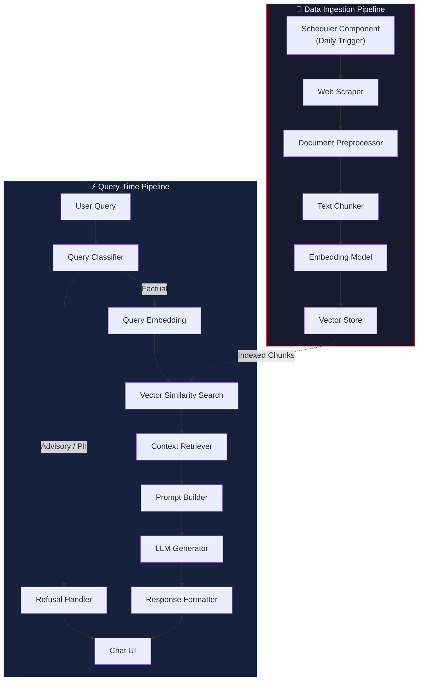
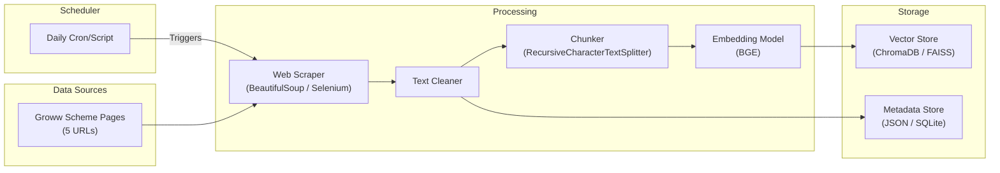
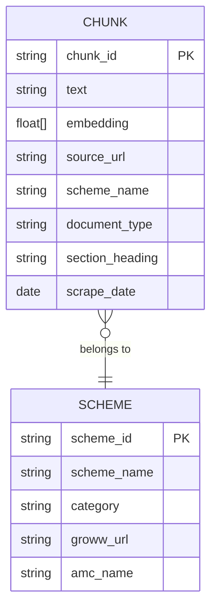
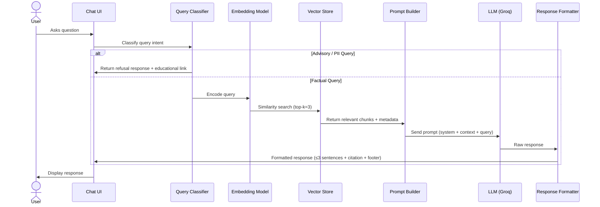
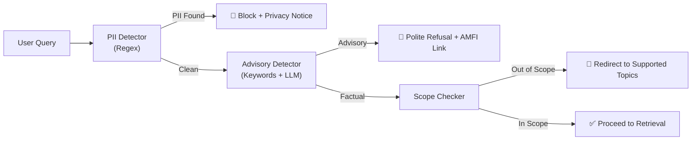
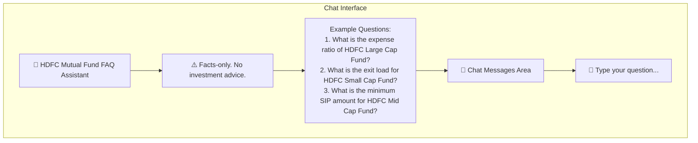
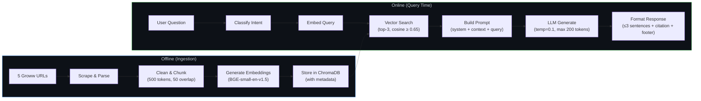

# Architecture: Mutual Fund FAQ Assistant (RAG Chatbot)

> This document describes the end-to-end architecture of the HDFC Mutual Fund Facts-Only FAQ Assistant built using a Retrieval-Augmented Generation (RAG) pipeline.

---

## 1. High-Level Architecture



---

## 2. Component Breakdown

### 2.1 Data Ingestion Pipeline

The ingestion pipeline runs **offline** (or on a scheduled basis) to build and refresh the vector store.



#### Data Sources

| Source | Format | Scraping Method | URLs |
|---|---|---|---|
| HDFC Large Cap Fund – Direct Growth | HTML | `requests` + `BeautifulSoup` / `Selenium` | [Groww Link](https://groww.in/mutual-funds/hdfc-large-cap-fund-direct-growth) |
| HDFC Mid Cap Fund – Direct Growth | HTML | `requests` + `BeautifulSoup` / `Selenium` | [Groww Link](https://groww.in/mutual-funds/hdfc-mid-cap-fund-direct-growth) |
| HDFC Small Cap Fund – Direct Growth | HTML | `requests` + `BeautifulSoup` / `Selenium` | [Groww Link](https://groww.in/mutual-funds/hdfc-small-cap-fund-direct-growth) |
| HDFC Gold ETF Fund of Fund – Direct Growth | HTML | `requests` + `BeautifulSoup` / `Selenium` | [Groww Link](https://groww.in/mutual-funds/hdfc-gold-etf-fund-of-fund-direct-plan-growth) |
| HDFC Silver ETF FoF – Direct Growth | HTML | `requests` + `BeautifulSoup` / `Selenium` | [Groww Link](https://groww.in/mutual-funds/hdfc-silver-etf-fof-direct-growth) |

#### Web Scraper Module

```
scraper/
├── base_scraper.py          # Abstract base class for all scrapers
├── groww_scraper.py          # Scrapes Groww mutual fund scheme pages
└── utils.py                  # URL validation, rate limiting, retry logic
```

**Key responsibilities:**
- Fetch HTML content from the **5 Groww scheme URLs**
- Parse and extract structured data (expense ratio, exit load, NAV, SIP details, etc.)
- Store raw text with **source metadata** (URL, scrape date, scheme name)

#### Document Preprocessor

| Step | Description |
|---|---|
| **HTML Stripping** | Remove navigation, ads, footers — retain only content sections |
| **Text Normalization** | Lowercase, remove extra whitespace, standardize date formats |
| **Table Extraction** | Parse HTML tables into structured key-value pairs |
| **Deduplication** | Remove duplicate content across overlapping sources |
| **Metadata Tagging** | Attach source URL, scheme name, document type, scrape timestamp |

#### Scheduler Component
A dedicated `scheduler/daily_job.py` module runs independently of the web application. Using the `schedule` library (or an OS-level cron job), it triggers the web scraper and the embeddings pipeline every night to keep the ChromaDB Vector Store up to date with the latest fund data from Groww.

#### Text Chunking Strategy

```python
# Chunking configuration
CHUNK_CONFIG = {
    "chunk_size": 500,          # tokens per chunk
    "chunk_overlap": 50,        # overlapping tokens between chunks
    "separator": ["\n\n", "\n", ". ", " "],  # split hierarchy
    "metadata_fields": [
        "source_url",
        "scheme_name",
        "document_type",
        "section_heading",
        "scrape_date"
    ]
}
```

**Why 500 tokens?**
- Small enough to ensure high retrieval precision for specific facts (expense ratio, exit load)
- Large enough to retain contextual coherence within a chunk
- Overlap of 50 tokens prevents information loss at chunk boundaries

---

### 2.2 Embedding & Vector Store

#### Embedding Model

| Property | Value |
|---|---|
| **Model** | `BAAI/bge-small-en-v1.5` (or `BAAI/bge-base-en-v1.5` for higher accuracy) |
| **Dimension** | 384 (bge-small) / 768 (bge-base) |
| **Why?** | State-of-the-art retrieval performance on MTEB benchmarks, optimized for RAG use cases |
| **Alternative** | `BAAI/bge-large-en-v1.5` (if higher accuracy is needed at the cost of speed) |

#### Vector Store

| Property | Value |
|---|---|
| **Primary** | **ChromaDB** (persistent, lightweight, Python-native) |
| **Alternative** | FAISS (for larger-scale or production deployments) |
| **Distance Metric** | Cosine similarity |
| **Index Type** | HNSW (Hierarchical Navigable Small World) |



**Stored metadata per chunk:**

```json
{
  "chunk_id": "hdfc-largecap-factsheet-003",
  "source_url": "https://groww.in/mutual-funds/hdfc-large-cap-fund-direct-growth",
  "scheme_name": "HDFC Large Cap Fund – Direct Growth",
  "document_type": "scheme_page",
  "section_heading": "Fund Details",
  "scrape_date": "2026-07-09"
}
```

---

### 2.3 Query-Time Pipeline



#### 2.3.1 Query Classifier

The query classifier is the **first gatekeeper** in the pipeline. It categorizes incoming queries before any retrieval happens.

| Classification | Action | Example |
|---|---|---|
| `FACTUAL` | Proceed to retrieval + generation | "What is the expense ratio of HDFC Large Cap Fund?" |
| `ADVISORY` | Return refusal with educational link | "Should I invest in HDFC Small Cap Fund?" |
| `COMPARISON` | Return refusal with factsheet link | "Which is better — HDFC Large Cap or Mid Cap?" |
| `PII_DETECTED` | Block immediately with privacy notice | "My PAN is ABCDE1234F, check my portfolio" |
| `OUT_OF_SCOPE` | Return polite redirection | "What is the weather today?" |

**Implementation approach:**
- **Rule-based layer**: Regex patterns to detect PII (PAN, Aadhaar, phone, email) and advisory keywords ("should I", "recommend", "better", "best")
- **LLM-based layer** (fallback): Use the LLM itself with a classification prompt for ambiguous queries

#### 2.3.2 Retrieval Strategy

```python
# Retrieval configuration
RETRIEVAL_CONFIG = {
    "top_k": 3,                       # Number of chunks to retrieve
    "similarity_threshold": 0.65,     # Minimum cosine similarity score
    "reranking": True,                # Enable cross-encoder reranking
    "metadata_filter": {
        "scheme_name": "<extracted from query>",  # Optional: filter by scheme
    }
}
```

**Retrieval steps:**
1. **Embed** the user query using the same embedding model
2. **Vector search** against ChromaDB with `top_k=3`
3. **Filter** results below the similarity threshold (0.65)
4. **(Optional) Rerank** using a cross-encoder model for higher precision
5. **Extract metadata** (source URL, scrape date) for citation

#### 2.3.3 Prompt Builder

The prompt builder assembles the final prompt sent to the LLM.

```
┌─────────────────────────────────────────────────────┐
│  SYSTEM PROMPT                                      │
│  ─────────────────                                  │
│  You are a facts-only mutual fund FAQ assistant.    │
│  Rules:                                             │
│  - Answer in ≤3 sentences                           │
│  - Include exactly one source citation              │
│  - Add footer: "Last updated from sources: <date>"  │
│  - Never give investment advice                     │
│  - If unsure, say "I don't have this information"   │
├─────────────────────────────────────────────────────┤
│  CONTEXT (Retrieved Chunks)                         │
│  ─────────────────────────                          │
│  [Chunk 1] Source: <url> | Scheme: <name>           │
│  [Chunk 2] Source: <url> | Scheme: <name>           │
│  [Chunk 3] Source: <url> | Scheme: <name>           │
├─────────────────────────────────────────────────────┤
│  USER QUERY                                         │
│  ──────────                                         │
│  <user's question>                                  │
└─────────────────────────────────────────────────────┘
```

#### 2.3.4 LLM Generator

| Property | Value |
|---|---|
| **Provider** | **Groq** |
| **Primary Model** | `llama-3.3-70b-versatile` |
| **Temperature** | `0.1` (low creativity, high factual accuracy) |
| **Max Tokens** | `200` (enforces concise responses) |
| **Fallback** | `gemma2-9b-it` (lighter alternative on Groq) |

> [!NOTE]
> A low temperature (`0.1`) is critical for this use case — we prioritize factual accuracy over creative language.

#### 2.3.5 Response Formatter

Every response is post-processed to ensure compliance:

```python
def format_response(raw_response, source_url, scrape_date):
    """
    Ensures every response follows the mandated format:
    - ≤ 3 sentences
    - Exactly 1 citation link
    - Footer with last updated date
    """
    response = {
        "answer": truncate_to_sentences(raw_response, max_sentences=3),
        "citation": source_url,
        "footer": f"Last updated from sources: {scrape_date}"
    }
    return response
```

---

### 2.4 Guardrails & Safety Layer



#### PII Detection Patterns

| PII Type | Regex Pattern | Action |
|---|---|---|
| PAN Number | `[A-Z]{5}[0-9]{4}[A-Z]` | Block |
| Aadhaar Number | `[0-9]{4}\s?[0-9]{4}\s?[0-9]{4}` | Block |
| Phone Number | `(\+91)?[6-9][0-9]{9}` | Block |
| Email Address | `[a-zA-Z0-9._%+-]+@[a-zA-Z0-9.-]+\.[a-zA-Z]{2,}` | Block |
| Account Number | `[0-9]{9,18}` | Flag for review |

#### Advisory Query Keywords

```python
ADVISORY_KEYWORDS = [
    "should i", "recommend", "better", "best", "worth it",
    "good fund", "bad fund", "invest in", "buy", "sell",
    "compare returns", "which one", "suggest", "opinion",
    "prediction", "forecast", "will it grow"
]
```

---

### 2.5 User Interface

A minimal chat interface fulfilling the problem statement requirements.



**UI Stack:**

| Component | Technology |
|---|---|
| **Frontend** | Streamlit / Gradio (rapid prototyping) |
| **Chat Component** | `st.chat_message` / Gradio `ChatInterface` |
| **Styling** | Custom CSS for branding |
| **Deployment** | Streamlit Cloud / Local |

**UI Features:**
- Welcome message with HDFC AMC branding
- 3 clickable example questions
- Persistent disclaimer banner
- Chat history within session
- Citation links rendered as clickable hyperlinks
- "Last updated" footer on every response

---

## 3. Project Directory Structure

```
RAG_CHATBOT/
├── docs/
│   ├── problemStatement.md          # Project requirements & scope
│   ├── problemStatement.txt         # Original plain-text problem statement
│   └── Architecture.md             # This document
│
├── data/
│   ├── raw/                        # Raw scraped HTML from Groww
│   │   └── groww/                  # Groww scheme page snapshots
│   ├── processed/                  # Cleaned & chunked text files
│   └── urls.json                   # Master list of 5 Groww source URLs
│
├── scraper/
│   ├── __init__.py
│   ├── base_scraper.py             # Abstract scraper base class
│   ├── groww_scraper.py            # Groww page scraper
│   └── utils.py                    # Shared utilities
│
├── scheduler/
│   ├── __init__.py
│   └── daily_job.py                # Scheduled ingestion trigger
│
├── embeddings/
│   ├── __init__.py
│   ├── chunker.py                  # Text chunking logic
│   ├── embedder.py                 # Embedding generation
│   └── vector_store.py             # ChromaDB / FAISS operations
│
├── pipeline/
│   ├── __init__.py
│   ├── query_classifier.py         # Query intent classification
│   ├── retriever.py                # Vector search & reranking
│   ├── prompt_builder.py           # Prompt template assembly
│   ├── generator.py                # LLM interaction (Groq)
│   ├── response_formatter.py       # Output formatting & compliance
│   └── guardrails.py               # PII detection & refusal handling
│
├── ui/
│   ├── app.py                      # Streamlit / Gradio chat interface
│   ├── components.py               # UI components (header, disclaimer)
│   └── styles.css                  # Custom styling
│
├── config/
│   ├── settings.py                 # App configuration & constants
│   └── prompts.py                  # System prompts & templates
│
├── tests/
│   ├── test_scraper.py
│   ├── test_chunker.py
│   ├── test_retriever.py
│   ├── test_classifier.py
│   └── test_guardrails.py
│
├── .env                            # API key (Groq)
├── .gitignore
├── requirements.txt
├── README.md
└── main.py                         # Entry point
```

---

## 4. Data Flow Summary



---

## 5. Technology Stack Summary

| Layer | Technology | Purpose |
|---|---|---|
| **Language** | Python 3.10+ | Core development language |
| **Web Scraping** | `requests`, `BeautifulSoup4`, `Selenium` | Groww page HTML extraction |
| **Text Chunking** | `langchain.text_splitter` | Recursive character splitting |
| **Embeddings** | `BAAI/bge-small-en-v1.5` (HuggingFace) | Text → vector conversion |
| **Vector Store** | `ChromaDB` | Persistent vector storage & search |
| **LLM** | Groq (`llama-3.3-70b-versatile` / `gemma2-9b-it`) | Response generation |
| **Orchestration** | `LangChain` | RAG pipeline orchestration |
| **UI** | `Streamlit` / `Gradio` | Chat interface |
| **Testing** | `pytest` | Unit & integration tests |
| **Environment** | `python-dotenv` | API key management |

---

## 6. Key Design Decisions

| Decision | Rationale |
|---|---|
| **ChromaDB over Pinecone/Weaviate** | Lightweight, runs locally, no cloud dependency, ideal for a 5-URL corpus |
| **Chunk size of 500 tokens** | Balances retrieval precision (specific facts) with contextual coherence |
| **Top-3 retrieval** | Provides sufficient context without overwhelming the LLM prompt |
| **Temperature 0.1** | Prioritizes factual accuracy over creative generation |
| **Rule-based PII detection** | Faster and more deterministic than LLM-based detection for known patterns |
| **Streamlit for UI** | Fastest path to a functional chat interface; built-in chat components |
| **Metadata-rich chunks** | Enables source citation and "last updated" footer without additional lookups |

---

## 7. Non-Functional Requirements

| Requirement | Target |
|---|---|
| **Response Latency** | < 3 seconds per query |
| **Accuracy** | > 90% factual correctness on test queries |
| **Availability** | Local deployment (no SLA required) |
| **Data Freshness** | Re-scrape corpus weekly or on-demand |
| **Compliance** | Zero investment advice; zero PII storage |
| **Scalability** | Designed for 5 schemes; extendable to full AMC catalog |

---

## 8. Future Enhancements

| Enhancement | Description |
|---|---|
| **Multi-AMC Support** | Extend beyond HDFC to cover SBI, ICICI Prudential, etc. |
| **Conversation Memory** | Multi-turn conversations with context carry-over |
| **Feedback Loop** | User thumbs up/down to improve retrieval quality |
| **API Layer** | REST API wrapper (FastAPI) for integration with other systems |
| **Advanced Reranking** | Cross-encoder reranking for improved retrieval precision |
| **Caching** | Cache frequent queries to reduce LLM API costs |
