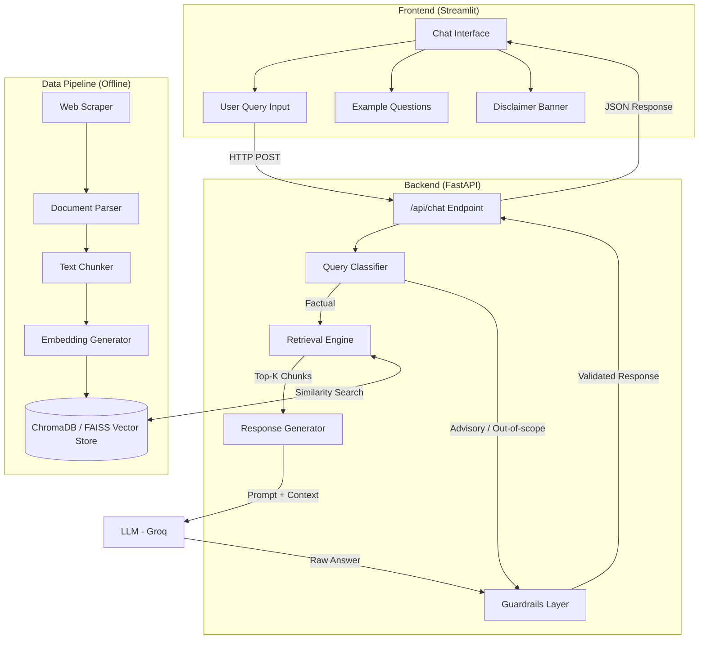
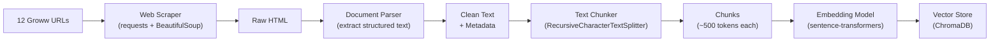
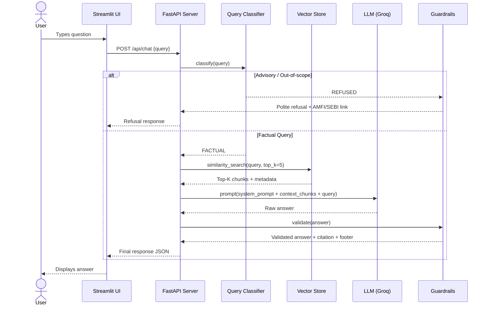
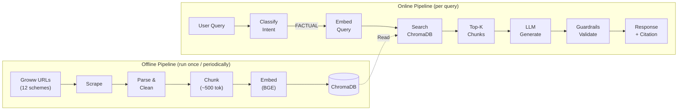

# Architecture — Mutual Fund FAQ Assistant (RAG Chatbot)

> Reference: [context.md](file:///d:/NEXTLEAP%20GEN%20AI/RAG_CHATBOT/docs/context.md)

---

## 1. High-Level System Overview



---

## 2. Architecture Layers

The system is organized into **five layers**, each with a clear responsibility:

| Layer | Responsibility | Key Components |
|-------|---------------|----------------|
| **Presentation** | User interaction, chat UI | Streamlit app, disclaimer, example questions |
| **API** | Request routing, session management | FastAPI server, `/api/chat` endpoint |
| **Intelligence** | Query classification, response generation, guardrails | Query Classifier, LLM, Guardrails |
| **Retrieval** | Semantic search over vectorized corpus | Embedding model, Vector store, Reranker |
| **Data** | Offline ingestion, chunking, embedding | Web scraper, document parser, chunker |

---

## 3. Data Ingestion Pipeline (Offline)

This pipeline runs **offline / on-demand** to build and refresh the vector store.

### 3.1 Pipeline Stages



### 3.2 Web Scraping

| Aspect | Detail |
|--------|--------|
| **Tool** | `requests` + `BeautifulSoup4` (or `Selenium` for JS-rendered pages) |
| **Targets** | 12 Groww scheme pages (sole data source — no PDFs or other external docs) |
| **Extracted Fields** | Scheme name, NAV, expense ratio, exit load, min SIP, benchmark, risk level, fund manager, AUM, category, launch date |
| **Rate Limiting** | 1–2 second delay between requests, respect `robots.txt` |
| **Output** | JSON files per scheme stored in `data/raw/` |

### 3.3 Document Parsing & Cleaning

```
Raw HTML  →  Strip tags, scripts, styles
          →  Extract relevant sections (scheme details, FAQ blocks)
          →  Normalize whitespace, fix encoding
          →  Attach metadata: { source_url, scheme_name, category, scrape_date }
          →  Save as structured JSON in data/parsed/
```

### 3.4 Chunking Strategy

| Parameter | Value | Rationale |
|-----------|-------|-----------|
| **Method** | `RecursiveCharacterTextSplitter` (LangChain) | Respects sentence/paragraph boundaries |
| **Chunk Size** | ~500 tokens (~2000 chars) | Balances context richness vs. retrieval precision |
| **Chunk Overlap** | ~50 tokens (~200 chars) | Prevents information loss at boundaries |
| **Metadata per chunk** | `scheme_name`, `category`, `source_url`, `section`, `scrape_date` | Enables filtered retrieval + citation |

### 3.5 Embedding & Vector Store

| Aspect | Choice | Rationale |
|--------|--------|-----------|
| **Embedding Model** | `BAAI/bge-small-en-v1.5` (384-dim) | BGE family — strong retrieval quality, lightweight, open-source |
| **Alternative** | `BAAI/bge-base-en-v1.5` (768-dim) | Higher quality, slightly more compute |
| **Vector Store** | **ChromaDB** (persistent, local) | Zero-infra, Python-native, metadata filtering |
| **Alternative** | FAISS | Faster at scale, but no built-in metadata filtering |
| **Persistence** | `data/vectorstore/chroma_db/` | Survives restarts without re-embedding |

---

## 4. Query Processing Pipeline (Online)

This pipeline executes **per user query** at inference time.

### 4.1 End-to-End Flow



### 4.2 Query Classification

A lightweight classifier determines query intent **before** retrieval:

| Intent | Description | Action |
|--------|-------------|--------|
| `FACTUAL` | Objective question about a scheme's attributes | Proceed to retrieval + generation |
| `ADVISORY` | Asks for recommendations, comparisons, or opinions | Return polite refusal |
| `PII_DETECTED` | Contains PAN, Aadhaar, account numbers, etc. | Return privacy warning, do not process |
| `OUT_OF_SCOPE` | Unrelated to mutual funds | Return scope clarification |

**Implementation Options:**

1. **Keyword / Regex rules** — Fast, deterministic, handles common patterns
2. **LLM-based classification** — Send query to LLM with a classification prompt (more flexible)
3. **Hybrid** — Regex first for PII / obvious advisory, LLM fallback for ambiguous cases

### 4.3 Retrieval Strategy

```python
# Pseudocode for retrieval
def retrieve(query: str, scheme_filter: str = None) -> list[Document]:
    # 1. Embed the query
    query_embedding = embedding_model.encode(query)
    
    # 2. Similarity search with optional metadata filter
    filters = {"scheme_name": scheme_filter} if scheme_filter else {}
    results = vector_store.similarity_search(
        query_embedding,
        k=5,               # Top-K candidates
        filter=filters
    )
    
    # 3. (Optional) Rerank with cross-encoder
    reranked = cross_encoder.rerank(query, results, top_k=3)
    
    return reranked
```

| Parameter | Value | Notes |
|-----------|-------|-------|
| **Initial Retrieval K** | 5 | Cast a wider net |
| **Final Top-K (post-rerank)** | 3 | Feed to LLM context window |
| **Similarity Metric** | Cosine similarity | Standard for sentence embeddings |
| **Metadata Filtering** | By `scheme_name` when query mentions a specific fund | Improves precision significantly |
| **Reranker (optional)** | `cross-encoder/ms-marco-MiniLM-L-6-v2` | Improves relevance ranking |

### 4.4 LLM Response Generation

| Aspect | Detail |
|--------|--------|
| **Primary LLM** | Groq (`llama-3.3-70b-versatile`) |
| **Temperature** | `0.1` (near-deterministic for factual accuracy) |
| **Max Output Tokens** | `256` (enforces conciseness) |
| **System Prompt** | See § 4.5 below |

### 4.5 System Prompt Design

```text
You are a facts-only FAQ assistant for HDFC Mutual Fund schemes.

RULES:
1. Answer ONLY using the provided context chunks. Do NOT use prior knowledge.
2. Keep your answer to a MAXIMUM of 3 sentences.
3. Include exactly ONE source citation link from the context metadata.
4. End every response with: "Last updated from sources: <scrape_date>"
5. If the context does not contain the answer, say:
   "I don't have this information in my current sources. Please visit
   [HDFC Mutual Fund](https://www.hdfcfund.com) for the latest details."
6. NEVER provide investment advice, opinions, or recommendations.
7. NEVER compare fund performance or calculate returns.
8. If asked for advice, respond: "I can only share verified facts about
   mutual fund schemes. For investment guidance, please consult a
   SEBI-registered advisor."

CONTEXT:
{retrieved_chunks}

USER QUESTION:
{user_query}
```

---

## 5. Guardrails & Safety

### 5.1 Input Guardrails

| Check | Implementation | Trigger Action |
|-------|---------------|----------------|
| **PII Detection** | Regex for PAN (`[A-Z]{5}[0-9]{4}[A-Z]`), Aadhaar (`\d{4}\s?\d{4}\s?\d{4}`), phone, email | Block query, return privacy warning |
| **Advisory Intent** | Keyword list (`"should I"`, `"recommend"`, `"which is better"`, `"best fund"`) + LLM classification | Polite refusal + educational link |
| **Prompt Injection** | Check for `"ignore previous"`, `"system prompt"`, role-play attempts | Block and return generic response |
| **Query Length** | Max 500 characters | Truncate or reject |

### 5.2 Output Guardrails

| Check | Implementation | Fallback |
|-------|---------------|----------|
| **Sentence Count** | Count sentences in LLM output, truncate if > 3 | Keep first 3 sentences |
| **Citation Presence** | Verify exactly 1 URL in response | Append source URL from top chunk metadata |
| **Footer Presence** | Check for `"Last updated from sources:"` | Append programmatically |
| **Advisory Language** | Scan for `"recommend"`, `"should"`, `"best"`, `"I suggest"` | Regenerate or replace with disclaimer |
| **Hallucination Check** | Verify key claims appear in retrieved chunks | Flag low-confidence answers |

---

## 6. API Design

### 6.1 Endpoints

```
POST /api/chat
```

**Request:**
```json
{
  "query": "What is the expense ratio of HDFC Mid Cap Fund?",
  "session_id": "optional-session-uuid"
}
```

**Response:**
```json
{
  "answer": "The expense ratio of HDFC Mid Cap Fund Direct Growth is 0.74% (as of the latest factsheet).",
  "source_url": "https://groww.in/mutual-funds/hdfc-mid-cap-fund-direct-growth",
  "last_updated": "2026-06-28",
  "intent": "FACTUAL",
  "confidence": 0.92
}
```

```
GET /api/health
```

**Response:**
```json
{
  "status": "healthy",
  "vector_store_docs": 156,
  "last_ingestion": "2026-06-28T18:00:00Z"
}
```

### 6.2 Error Responses

| HTTP Code | Scenario |
|-----------|----------|
| `200` | Successful response (including refusals) |
| `400` | Malformed request / query too long |
| `422` | PII detected in query |
| `500` | Internal error (LLM failure, vector store down) |
| `503` | Service temporarily unavailable |

---

## 7. Project Structure

```
RAG_CHATBOT/
├── docs/
│   ├── problemStatement.txt      # Original problem statement
│   ├── context.md                # Distilled project context
│   └── architecture.md           # This document
│
├── data/
│   ├── raw/                      # Raw scraped HTML/JSON per scheme
│   ├── parsed/                   # Cleaned, structured JSON documents
│   └── vectorstore/              # ChromaDB persistent storage
│       └── chroma_db/
│
├── src/
│   ├── __init__.py
│   ├── config.py                 # Centralized configuration & env vars
│   ├── scraper/
│   │   ├── __init__.py
│   │   └── groww_scraper.py      # Scrape the 12 Groww scheme pages
│   │
│   ├── ingestion/
│   │   ├── __init__.py
│   │   ├── parser.py             # HTML → structured text
│   │   ├── chunker.py            # Text → overlapping chunks
│   │   └── embedder.py           # Chunks → vector embeddings
│   │
│   ├── retrieval/
│   │   ├── __init__.py
│   │   ├── vector_store.py       # ChromaDB wrapper (add, query)
│   │   └── reranker.py           # Optional cross-encoder reranker
│   │
│   ├── generation/
│   │   ├── __init__.py
│   │   ├── llm_client.py         # LLM API wrapper (Gemini / OpenAI)
│   │   ├── prompt_templates.py   # System prompt & few-shot templates
│   │   └── response_builder.py   # Assemble final response with citation + footer
│   │
│   ├── guardrails/
│   │   ├── __init__.py
│   │   ├── input_guard.py        # PII detection, advisory detection, injection check
│   │   └── output_guard.py       # Sentence cap, citation check, advisory scan
│   │
│   └── api/
│       ├── __init__.py
│       ├── server.py             # FastAPI app definition & routes
│       └── models.py             # Pydantic request/response schemas
│
├── ui/
│   └── app.py                    # Streamlit chat interface
│
├── scripts/
│   ├── run_ingestion.py          # CLI to run full data pipeline
│   └── run_server.py             # CLI to start the API server
│
├── tests/
│   ├── test_scraper.py
│   ├── test_chunker.py
│   ├── test_retrieval.py
│   ├── test_guardrails.py
│   └── test_api.py
│
├── .env.example                  # Template for API keys & config
├── requirements.txt              # Python dependencies
├── README.md                     # Setup, usage, limitations
└── .gitignore
```

---

## 8. Technology Stack

| Component | Technology | Version / Notes |
|-----------|-----------|-----------------|
| **Language** | Python | 3.10+ |
| **Web Framework** | FastAPI | Async, auto-docs at `/docs` |
| **Frontend** | Streamlit | Rapid chat UI prototyping |
| **Web Scraping** | requests + BeautifulSoup4 | Static pages; Selenium for JS-rendered |
| **Text Splitting** | LangChain `RecursiveCharacterTextSplitter` | Configurable chunk size/overlap |
| **Embeddings** | `BAAI/bge-small-en-v1.5` | BGE family, local, free, 384-dim |
| **Vector Store** | ChromaDB | Persistent, local, metadata filtering |
| **LLM** | Groq (`llama-3.3-70b-versatile`) | Fast inference, strong reasoning |
| **LLM Orchestration** | LangChain | Chains, prompt templates, output parsers |
| **Reranker (opt.)** | `cross-encoder/ms-marco-MiniLM-L-6-v2` | Improves retrieval precision |
| **Config** | python-dotenv | `.env` for API keys |
| **Testing** | pytest | Unit + integration tests |

---

## 9. Configuration & Environment Variables

```bash
# .env.example

# LLM Configuration
LLM_PROVIDER=groq
GROQ_API_KEY=your-groq-key-here

# Embedding Model
EMBEDDING_MODEL=BAAI/bge-small-en-v1.5

# Vector Store
CHROMA_PERSIST_DIR=./data/vectorstore/chroma_db
CHROMA_COLLECTION_NAME=hdfc_mutual_funds

# Retrieval Parameters
RETRIEVAL_TOP_K=5
RERANK_TOP_K=3
SIMILARITY_THRESHOLD=0.3

# LLM Parameters
LLM_TEMPERATURE=0.1
LLM_MAX_TOKENS=256

# Scraping
SCRAPE_DELAY_SECONDS=2

# Server
API_HOST=0.0.0.0
API_PORT=8000
STREAMLIT_PORT=8501
```

---

## 10. Data Flow Summary



---

## 11. Deployment Strategy

### 11.1 Local Development

```bash
# 1. Install dependencies
pip install -r requirements.txt

# 2. Run data ingestion (one-time)
python scripts/run_ingestion.py

# 3. Start API server
python scripts/run_server.py           # FastAPI on :8000

# 4. Start UI (separate terminal)
streamlit run ui/app.py --server.port 8501
```

### 11.2 Production Considerations

| Concern | Approach |
|---------|----------|
| **Scalability** | Containerize with Docker; use Gunicorn + Uvicorn workers |
| **Vector Store** | Migrate to managed service (Pinecone, Weaviate) if corpus grows |
| **Caching** | Cache frequent queries + responses (Redis / in-memory LRU) |
| **Monitoring** | Log queries, latencies, refusal rates; alert on LLM errors |
| **Data Freshness** | Schedule weekly re-scrape via cron to update NAV and scheme data |
| **Rate Limiting** | Apply per-IP rate limits on `/api/chat` |

---

## 12. Key Design Decisions

| Decision | Choice | Rationale |
|----------|--------|-----------|
| ChromaDB over Pinecone | **ChromaDB** | Zero cost, local-first, sufficient for ~200 chunks |
| BGE over OpenAI embeddings | **BAAI/bge-small-en-v1.5** | No API cost, strong retrieval quality, privacy |
| FastAPI over Flask | **FastAPI** | Async, auto-generated docs, Pydantic validation |
| Streamlit over React | **Streamlit** | Faster to build, sufficient for minimal chat UI |
| Hybrid guardrails (regex + LLM) | **Hybrid** | Regex for deterministic checks, LLM for nuanced intent |
| Chunk size 500 tokens | **500 tokens** | Balances retrieval granularity vs. context richness |
| Temperature 0.1 | **Near-zero** | Factual accuracy > creativity |

---

## 13. Limitations & Known Risks

| Risk | Mitigation |
|------|------------|
| **Stale data** | Schedule periodic re-scraping; display `Last updated` date |
| **Scraping breakage** | Groww HTML structure changes → scraper maintenance needed |
| **LLM hallucination** | Low temperature + retrieved-context-only prompt + output validation |
| **Incomplete coverage** | 12 schemes × 1 AMC only; out-of-scope queries get refusal |
| **No auth/rate-limit** | Add API key auth + rate limiter before public deployment |
| **Single-turn only** | No conversation memory; each query is independent |
