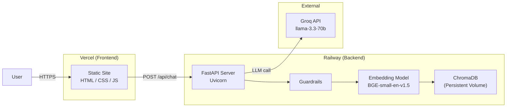
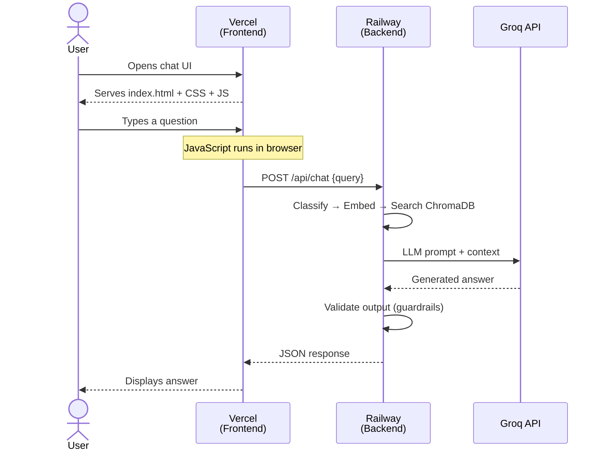
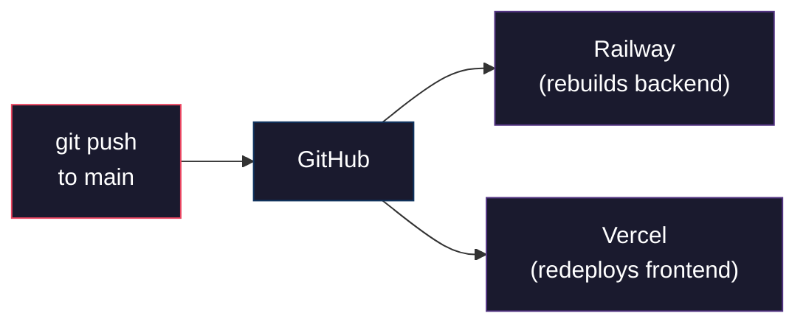
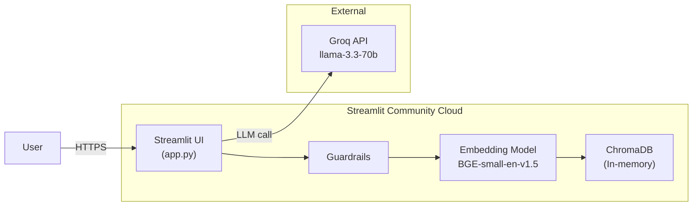

# Deployment Plan — Vercel + Railway | Streamlit Cloud

> **Option A (Primary):** Frontend → Vercel · Backend → Railway  
> **Option B (Alternative):** Full-stack → Streamlit Community Cloud

> Reference: [architecture.md](file:///d:/NEXTLEAP%20GEN%20AI/RAG_CHATBOT/docs/architecture.md) · [implementation-plan.md](file:///d:/NEXTLEAP%20GEN%20AI/RAG_CHATBOT/docs/implementation-plan.md)

---

## Table of Contents

1. [Architecture Overview](#1-architecture-overview)
2. [Prerequisites](#2-prerequisites)
3. [Railway — Backend Deployment](#3-railway--backend-deployment)
4. [Vercel — Frontend Deployment](#4-vercel--frontend-deployment)
5. [Connecting Frontend to Backend](#5-connecting-frontend-to-backend)
6. [Data Ingestion on Railway](#6-data-ingestion-on-railway)
7. [Environment Variables Reference](#7-environment-variables-reference)
8. [CI/CD — Auto-Deploy from GitHub](#8-cicd--auto-deploy-from-github)
9. [Monitoring & Logs](#9-monitoring--logs)
10. [Cost Breakdown](#10-cost-breakdown)
11. [Troubleshooting](#11-troubleshooting)
12. [Deployment Checklist](#12-deployment-checklist)
13. [Alternative: Streamlit Cloud Deployment](#13-alternative-streamlit-cloud-deployment)

---

## 1. Architecture Overview



| Component | Platform | What Gets Deployed |
|-----------|----------|--------------------|
| **Frontend** | Vercel | `frontend/` directory (index.html, styles.css, script.js) |
| **Backend** | Railway | Docker container with FastAPI, ChromaDB, BGE-small embedding model |
| **Vector Store** | Railway | ChromaDB on a persistent volume (`/app/data/vectorstore`) |
| **LLM** | Groq (external) | API call — nothing to deploy |

---

## 2. Prerequisites

### Accounts Required

| Service | Sign Up | Free Tier |
|---------|---------|-----------|
| **GitHub** | [github.com](https://github.com) | ✅ Free |
| **Railway** | [railway.app](https://railway.app) | $5 free trial credit, then $5/mo + usage |
| **Vercel** | [vercel.com](https://vercel.com) | ✅ Free (Hobby plan) |
| **Groq** | [console.groq.com](https://console.groq.com) | ✅ Free (rate-limited) |

### Local Tools

```bash
# Required
git --version          # 2.40+
node --version         # 18+ (for Vercel CLI)
python --version       # 3.10+

# Install CLIs
npm install -g vercel
npm install -g @railway/cli
```

### Push Code to GitHub

Your project must be in a GitHub repository. If it isn't already:

```bash
cd "d:\NEXTLEAP GEN AI\RAG_CHATBOT"
git init
git add .
git commit -m "Initial commit"
git remote add origin https://github.com/<your-username>/RAG_CHATBOT.git
git push -u origin main
```

---

## 3. Railway — Backend Deployment

### 3.1 Create the Dockerfile

Create this file at the project root:

```dockerfile
# File: Dockerfile
FROM python:3.11-slim

WORKDIR /app

# Install system dependencies
RUN apt-get update && apt-get install -y --no-install-recommends \
    build-essential \
    && rm -rf /var/lib/apt/lists/*

# Install Python dependencies
COPY requirements.txt .
RUN pip install --no-cache-dir -r requirements.txt
RUN pip install --no-cache-dir gunicorn

# Pre-download the embedding model (~130 MB)
# This avoids downloading on every container restart
RUN python -c "from sentence_transformers import SentenceTransformer; \
    SentenceTransformer('BAAI/bge-small-en-v1.5')"

# Copy application code
COPY src/ ./src/
COPY scripts/ ./scripts/
COPY data/ ./data/
COPY .env.example ./.env.example

# Expose port (Railway auto-detects this)
EXPOSE 8000

# Start FastAPI with Uvicorn
CMD ["uvicorn", "src.api.server:app", "--host", "0.0.0.0", "--port", "8000"]
```

Add a `.dockerignore` at the project root:

```
# File: .dockerignore
venv/
.env
.git/
.pytest_cache/
__pycache__/
*.pyc
docs/
tests/
scratch/
frontend/
stitch_hdfc_mutual_fund_chatbot/
ui/
*.md
!requirements.txt
```

### 3.2 Deploy to Railway (GUI Method)

1. **Go to** [railway.app](https://railway.app) and sign in with GitHub

2. **Create a New Project**
   - Click **"New Project"** → **"Deploy from GitHub Repo"**
   - Select your `RAG_CHATBOT` repository
   - Railway auto-detects the `Dockerfile`

3. **Add Environment Variables**
   - Go to your service → **Variables** tab
   - Add each variable:

   | Variable | Value |
   |----------|-------|
   | `GROQ_API_KEY` | `gsk_xxxxxxxxxxxxxxxx` |
   | `LLM_PROVIDER` | `groq` |
   | `EMBEDDING_MODEL` | `BAAI/bge-small-en-v1.5` |
   | `CHROMA_PERSIST_DIR` | `/app/data/vectorstore/chroma_db` |
   | `CHROMA_COLLECTION_NAME` | `hdfc_mutual_funds` |
   | `RETRIEVAL_TOP_K` | `5` |
   | `RERANK_TOP_K` | `3` |
   | `LLM_TEMPERATURE` | `0.1` |
   | `LLM_MAX_TOKENS` | `256` |
   | `SCRAPE_DELAY_SECONDS` | `2` |
   | `API_HOST` | `0.0.0.0` |
   | `API_PORT` | `8000` |
   | `PORT` | `8000` |

4. **Attach a Persistent Volume** (for ChromaDB data)
   - Go to your service → **Volumes** tab
   - Click **"New Volume"**
   - Mount path: `/app/data/vectorstore`
   - Size: 1 GB (more than enough for 168 chunks)

5. **Generate a Public URL**
   - Go to **Settings** → **Networking** → **Public Networking**
   - Click **"Generate Domain"**
   - You'll get a URL like: `https://rag-chatbot-production-xxxx.up.railway.app`

6. **Verify Deployment**
   - Visit `https://your-app.up.railway.app/api/health`
   - Expected response:
   ```json
   {
     "status": "healthy",
     "vector_store_docs": 168,
     "last_ingestion": "Unknown"
   }
   ```

### 3.3 Deploy to Railway (CLI Method)

```bash
# Login to Railway
railway login

# Initialize project (link to existing GitHub repo)
railway init

# Set environment variables
railway variables set GROQ_API_KEY=gsk_xxxxxxxxxxxxxxxx
railway variables set LLM_PROVIDER=groq
railway variables set EMBEDDING_MODEL=BAAI/bge-small-en-v1.5
railway variables set CHROMA_PERSIST_DIR=/app/data/vectorstore/chroma_db
railway variables set CHROMA_COLLECTION_NAME=hdfc_mutual_funds
railway variables set RETRIEVAL_TOP_K=5
railway variables set RERANK_TOP_K=3
railway variables set LLM_TEMPERATURE=0.1
railway variables set LLM_MAX_TOKENS=256
railway variables set SCRAPE_DELAY_SECONDS=2
railway variables set API_HOST=0.0.0.0
railway variables set API_PORT=8000
railway variables set PORT=8000

# Add a persistent volume
railway volume add --mount /app/data/vectorstore

# Deploy
railway up

# Get the public URL
railway domain
```

### 3.4 Run Data Ingestion on Railway

After the first deploy, the ChromaDB volume is empty. You need to run ingestion once:

```bash
# Option 1: Railway CLI
railway run python scripts/run_ingestion.py

# Option 2: Railway shell (via Dashboard)
# Go to your service → click "Shell" tab → run:
python scripts/run_ingestion.py
```

Expected output:

```
Ingestion complete.
  Schemes processed: 12
  Attribute chunks:  132
  Section chunks:     24
  Full-doc chunks:    12
  Total chunks:      168
  ChromaDB collection size: 168
```

> [!IMPORTANT]
> **You must run ingestion at least once** after the first deployment. Without it, ChromaDB is empty and all queries will return "I don't have enough information."

---

## 4. Vercel — Frontend Deployment

### 4.1 Prepare the Frontend

Before deploying, update `frontend/script.js` to point to your Railway backend URL.

**Current code** (local-only):
```javascript
// No API URL configured — sendMessage() doesn't call the backend yet
```

**Updated code** — add the API call to `sendMessage()` in [script.js](file:///d:/NEXTLEAP%20GEN%20AI/RAG_CHATBOT/frontend/script.js):

```javascript
// At the top of script.js, set your Railway backend URL
const API_BASE_URL = "https://your-app.up.railway.app";

// ... existing code ...

async function sendMessage() {
    const text = userInput.value.trim();
    if (!text) return;

    // Show user message
    const messageDiv = document.createElement('div');
    messageDiv.className = 'message user';
    messageDiv.innerHTML = `
        <div class="message-content" style="align-items: flex-end;">
            <div class="message-bubble">${text}</div>
        </div>
    `;
    chatContainer.appendChild(messageDiv);
    userInput.value = '';
    chatArea.scrollTop = chatArea.scrollHeight;

    // Call the Railway backend
    try {
        const response = await fetch(`${API_BASE_URL}/api/chat`, {
            method: "POST",
            headers: { "Content-Type": "application/json" },
            body: JSON.stringify({ query: text }),
        });
        const data = await response.json();

        // Show bot response
        const botDiv = document.createElement('div');
        botDiv.className = 'message bot';
        botDiv.innerHTML = `
            <div class="bot-avatar"><i class="ph ph-robot"></i></div>
            <div class="message-content">
                <div class="bot-name">HDFC Assistant</div>
                <div class="message-bubble">${data.answer}</div>
            </div>
        `;
        chatContainer.appendChild(botDiv);
    } catch (error) {
        // Show error message
        const errDiv = document.createElement('div');
        errDiv.className = 'message bot';
        errDiv.innerHTML = `
            <div class="bot-avatar"><i class="ph ph-robot"></i></div>
            <div class="message-content">
                <div class="bot-name">HDFC Assistant</div>
                <div class="message-bubble">Sorry, something went wrong. Please try again.</div>
            </div>
        `;
        chatContainer.appendChild(errDiv);
    }

    chatArea.scrollTop = chatArea.scrollHeight;
}
```

> [!CAUTION]
> Replace `https://your-app.up.railway.app` with the actual Railway domain you generated in Step 3.2.5.

### 4.2 Deploy to Vercel (GUI Method)

1. **Go to** [vercel.com](https://vercel.com) and sign in with GitHub

2. **Import Project**
   - Click **"Add New"** → **"Project"**
   - Select your `RAG_CHATBOT` repository

3. **Configure Build Settings**

   | Setting | Value |
   |---------|-------|
   | **Framework Preset** | Other |
   | **Root Directory** | `frontend` |
   | **Build Command** | *(leave empty — no build needed for static files)* |
   | **Output Directory** | `.` |

4. **Deploy**
   - Click **"Deploy"**
   - Vercel will assign a URL like: `https://rag-chatbot-xxxx.vercel.app`

5. **Verify**
   - Visit your Vercel URL
   - The chat UI should load
   - Send a test question — it should hit your Railway backend and return an answer

### 4.3 Deploy to Vercel (CLI Method)

```bash
# Navigate to the frontend directory
cd "d:\NEXTLEAP GEN AI\RAG_CHATBOT\frontend"

# Login to Vercel
vercel login

# Deploy (follow the prompts)
vercel

# Prompts:
#   Set up and deploy? → Y
#   Which scope? → your account
#   Link to existing project? → N
#   Project name? → hdfc-mutual-fund-faq
#   Directory ./ is the root? → Y
#   Override settings? → N

# Deploy to production
vercel --prod
```

### 4.4 Custom Domain (Optional)

```bash
# Add a custom domain via Vercel CLI
vercel domains add yourdomain.com

# Or via Vercel Dashboard:
# Project → Settings → Domains → Add
```

---

## 5. Connecting Frontend to Backend

### 5.1 CORS Configuration

The Railway backend must allow requests from your Vercel domain. The current [server.py](file:///d:/NEXTLEAP%20GEN%20AI/RAG_CHATBOT/src/api/server.py) has `allow_origins=["*"]` which works, but for production tighten it:

```python
# src/api/server.py — update CORS for production
app.add_middleware(
    CORSMiddleware,
    allow_origins=[
        "https://rag-chatbot-xxxx.vercel.app",   # Your Vercel URL
        "https://yourdomain.com",                  # Custom domain (if any)
        "http://localhost:3000",                    # Local dev
    ],
    allow_methods=["GET", "POST"],
    allow_headers=["Content-Type"],
)
```

### 5.2 Connection Flow



### 5.3 Environment-Based API URL

To avoid hardcoding the Railway URL, use Vercel environment variables:

1. **Vercel Dashboard** → Project → **Settings** → **Environment Variables**
2. Add: `VITE_API_URL` = `https://your-app.up.railway.app`

Then in `script.js`:

```javascript
// This won't work directly in plain JS (no build step), so for a static site
// you can use a simple config approach:

// Option A: Hardcode the URL (simplest for static sites)
const API_BASE_URL = "https://your-app.up.railway.app";

// Option B: Detect environment automatically
const API_BASE_URL = window.location.hostname === "localhost"
    ? "http://localhost:8000"
    : "https://your-app.up.railway.app";
```

---

## 6. Data Ingestion on Railway

### 6.1 First-Time Ingestion

```bash
# Via Railway CLI (from your local machine)
railway run python scripts/run_ingestion.py
```

### 6.2 Re-Ingestion (Data Refresh)

When you want to refresh scheme data (NAV changes, etc.):

```bash
# Re-run the scraper + ingestion pipeline
railway run python scripts/run_ingestion.py
```

### 6.3 Scheduled Refresh with Railway Cron Jobs

Railway supports cron-triggered services for automated data refresh:

1. **Create a separate Railway service** in the same project
2. Set it as a **Cron Job**:
   - Schedule: `0 2 * * 0` (every Sunday at 2 AM UTC)
   - Command: `python scripts/run_ingestion.py`
3. This re-scrapes Groww and refreshes the ChromaDB data weekly

> [!NOTE]
> The persistent volume is shared across services in the same Railway project, so the cron job writes to the same ChromaDB that the API reads from.

---

## 7. Environment Variables Reference

### Railway (Backend)

| Variable | Value | Required |
|----------|-------|----------|
| `GROQ_API_KEY` | Your Groq API key | ✅ Yes |
| `LLM_PROVIDER` | `groq` | ✅ Yes |
| `EMBEDDING_MODEL` | `BAAI/bge-small-en-v1.5` | ✅ Yes |
| `CHROMA_PERSIST_DIR` | `/app/data/vectorstore/chroma_db` | ✅ Yes |
| `CHROMA_COLLECTION_NAME` | `hdfc_mutual_funds` | ✅ Yes |
| `RETRIEVAL_TOP_K` | `5` | Optional (default: 5) |
| `RERANK_TOP_K` | `3` | Optional (default: 3) |
| `LLM_TEMPERATURE` | `0.1` | Optional (default: 0.1) |
| `LLM_MAX_TOKENS` | `256` | Optional (default: 256) |
| `SCRAPE_DELAY_SECONDS` | `2` | Optional (default: 2) |
| `API_HOST` | `0.0.0.0` | ✅ Yes |
| `API_PORT` | `8000` | ✅ Yes |
| `PORT` | `8000` | ✅ Yes (Railway reads this) |

### Vercel (Frontend)

No environment variables needed for a static site. The API URL is set directly in `script.js`.

---

## 8. CI/CD — Auto-Deploy from GitHub

Both Vercel and Railway support **automatic deployments on git push**.

### How It Works



### Railway Auto-Deploy

- **Enabled by default** when you deploy from a GitHub repo
- Every push to `main` triggers a new build + deploy
- Rollback: click any previous deployment in the Railway dashboard

### Vercel Auto-Deploy

- **Enabled by default** when you import a GitHub repo
- Every push to `main` deploys to production
- PRs get automatic **preview deployments** (unique URL per PR)

### Adding Tests Before Deploy

Create `.github/workflows/test.yml` to run tests on every push:

```yaml
name: Tests

on:
  push:
    branches: [main]
  pull_request:
    branches: [main]

jobs:
  test:
    runs-on: ubuntu-latest
    steps:
      - uses: actions/checkout@v4
      - uses: actions/setup-python@v5
        with:
          python-version: "3.11"
      - run: pip install -r requirements.txt
      - run: pytest tests/ -v --tb=short
        env:
          GROQ_API_KEY: ${{ secrets.GROQ_API_KEY }}
```

> [!TIP]
> Add `GROQ_API_KEY` to your GitHub repository secrets: **Settings → Secrets and Variables → Actions → New repository secret**.

---

## 9. Monitoring & Logs

### Railway

| Feature | How to Access |
|---------|---------------|
| **Live logs** | Railway Dashboard → Service → **Logs** tab |
| **Metrics** (CPU, RAM) | Railway Dashboard → Service → **Metrics** tab |
| **Health check** | `GET https://your-app.up.railway.app/api/health` |
| **Deploy history** | Railway Dashboard → Service → **Deployments** tab |

### Vercel

| Feature | How to Access |
|---------|---------------|
| **Deploy logs** | Vercel Dashboard → Project → **Deployments** |
| **Analytics** | Vercel Dashboard → Project → **Analytics** (Hobby plan: basic) |
| **Edge network status** | [vercel.com/status](https://vercel.com/status) |

### External Uptime Monitoring (Free)

Set up a free uptime monitor to alert you if the backend goes down:

| Service | Free Tier | Setup |
|---------|-----------|-------|
| [UptimeRobot](https://uptimerobot.com) | 50 monitors, 5-min checks | Monitor `https://your-app.up.railway.app/api/health` |
| [Better Stack](https://betterstack.com) | 10 monitors, 3-min checks | Same URL |

---

## 10. Cost Breakdown

### Monthly Cost Estimate

| Service | Plan | Cost | What You Get |
|---------|------|------|-------------|
| **Vercel** | Hobby (Free) | **$0** | 100 GB bandwidth, auto-SSL, CDN, preview deploys |
| **Railway** | Hobby | **$5 base** + ~$2–5 usage | 8 GB RAM, 8 vCPU, persistent volumes, auto-deploy |
| **Groq** | Free | **$0** | 30 RPM, 1K RPD, 12K TPM |
| **GitHub** | Free | **$0** | Unlimited repos, Actions (2K min/mo) |
| **UptimeRobot** | Free | **$0** | 50 monitors |
| | | | |
| **Total** | | **~$5–10/mo** | |

### Railway Usage Pricing (Beyond $5 Base)

| Resource | Cost |
|----------|------|
| vCPU | $0.000463 / minute |
| Memory | $0.000231 / GB / minute |
| Disk | $0.000231 / GB / minute |

> [!NOTE]
> For this project (small FastAPI app, ~130 MB model, 168-chunk ChromaDB), Railway usage costs are typically **$2–5/month** on top of the $5 base. Total: **~$7–10/month**.

---

## 11. Troubleshooting

### Common Issues

| Problem | Cause | Fix |
|---------|-------|-----|
| **Frontend shows "Sorry, something went wrong"** | API URL mismatch or CORS error | Check `API_BASE_URL` in `script.js` matches your Railway domain. Check browser console for CORS errors. |
| **Railway build fails** | Missing dependencies or Dockerfile error | Check Railway build logs. Ensure `requirements.txt` is up to date. |
| **"I don't have enough information"** for all queries | ChromaDB is empty — ingestion hasn't run | Run `railway run python scripts/run_ingestion.py` |
| **Slow first response (~5–10s)** | Embedding model loading on cold start | Railway keeps containers warm on Hobby plan. If cold starts occur, the first request loads the ~130 MB model. |
| **Groq API errors** | Rate limit exceeded (30 RPM free tier) | Wait 1 minute, or upgrade Groq plan. |
| **Railway container crashes** | Out of memory | Check Railway metrics. The app needs ~500 MB–1 GB RAM. Ensure Railway service has enough memory allocated. |
| **Vercel deploy fails** | Wrong root directory | Ensure root directory is set to `frontend` in Vercel project settings. |
| **ChromaDB data lost after redeploy** | Volume not mounted | Ensure persistent volume is attached at `/app/data/vectorstore` in Railway. |

### Useful Debug Commands

```bash
# Check Railway deployment status
railway status

# View Railway logs
railway logs

# Open a shell in the Railway container
railway shell

# Test the API directly
curl https://your-app.up.railway.app/api/health

curl -X POST https://your-app.up.railway.app/api/chat \
  -H "Content-Type: application/json" \
  -d '{"query": "What is the expense ratio of HDFC Mid Cap Fund?"}'
```

---

## 12. Deployment Checklist

### Step-by-Step Summary

```
1. Push code to GitHub              ← prerequisite
2. Deploy backend on Railway        ← Section 3
3. Add env variables on Railway     ← Section 3.2 step 3
4. Attach persistent volume         ← Section 3.2 step 4
5. Generate public Railway URL      ← Section 3.2 step 5
6. Run data ingestion               ← Section 3.4
7. Update script.js with API URL    ← Section 4.1
8. Deploy frontend on Vercel        ← Section 4.2
9. Test end-to-end                  ← below
```

### Pre-Deployment

- [ ] Code pushed to GitHub
- [ ] `Dockerfile` and `.dockerignore` created at project root
- [ ] All tests pass locally (`pytest tests/ -v`)
- [ ] `GROQ_API_KEY` is valid and working

### Railway (Backend)

- [ ] Service deployed from GitHub repo
- [ ] All environment variables set (especially `GROQ_API_KEY`, `PORT`, `CHROMA_PERSIST_DIR`)
- [ ] Persistent volume mounted at `/app/data/vectorstore`
- [ ] Public domain generated
- [ ] `/api/health` returns `{"status": "healthy"}`
- [ ] Data ingestion completed (`vector_store_docs: 168`)

### Vercel (Frontend)

- [ ] `API_BASE_URL` in `script.js` set to Railway backend URL
- [ ] Root directory set to `frontend` in Vercel settings
- [ ] Site deployed and accessible
- [ ] Chat UI loads without console errors

### End-to-End Verification

- [ ] Factual query returns a correct answer with source citation
  - Test: *"What is the expense ratio of HDFC Mid Cap Fund?"*
- [ ] Advisory query returns polite refusal
  - Test: *"Should I invest in HDFC Mid Cap Fund?"*
- [ ] PII query is blocked
  - Test: *"My PAN is ABCDE1234F, what is NAV?"*
- [ ] Response includes "Last updated from sources" footer
- [ ] Response latency < 3 seconds
- [ ] Disclaimer banner ("Facts-only. No investment advice.") is visible

---

## 13. Alternative: Streamlit Cloud Deployment

If you want a **single-platform, zero-config** deployment instead of the Vercel + Railway split, you can deploy everything on [Streamlit Community Cloud](https://streamlit.io/cloud). This bundles the UI, backend logic, vector store, and embedding model into one Streamlit app.

> [!IMPORTANT]
> This approach uses the existing Streamlit UI in [`ui/app.py`](file:///d:/NEXTLEAP%20GEN%20AI/RAG_CHATBOT/ui/app.py). It runs everything in-process — no separate FastAPI server is needed.

### 13.1 Architecture Overview



| Component | Where It Runs | Notes |
|-----------|---------------|-------|
| **UI** | Streamlit Cloud | Built-in chat interface via `st.chat_message` |
| **Embedding Model** | Streamlit Cloud | Loaded in-process (~130 MB) |
| **Vector Store** | Streamlit Cloud | ChromaDB in-memory (rebuilt on each app restart) |
| **LLM** | Groq (external) | API call — same as Railway approach |
| **Guardrails** | Streamlit Cloud | Input/output guards run in-process |

> [!WARNING]
> Streamlit Community Cloud has **no persistent disk**. ChromaDB data lives in memory and is rebuilt from scraped data on every app restart (cold start). This adds ~30–60 seconds to the first load.

### 13.2 Restructure the App for Streamlit Cloud

Streamlit Cloud expects the entry point at the **repo root** or a configured path. You need to create a new `streamlit_app.py` at the project root that runs everything in-process (no FastAPI dependency).

Create this file at the project root:

```python
# File: streamlit_app.py (project root)
import streamlit as st
import uuid
from src.guardrails.input_guard import classify_query
from src.guardrails.output_guard import validate_output
from src.retrieval.vector_store import query as vector_query, collection
from src.generation.llm_client import generate
from src.generation.prompt_templates import (
    SYSTEM_PROMPT, REFUSAL_PII, REFUSAL_ADVISORY,
    REFUSAL_PROMPT_INJECTION, REFUSAL_TOO_LONG
)
from src.ingestion.embedder import embed_query

# Page config
st.set_page_config(
    page_title="HDFC Mutual Fund FAQ Assistant",
    page_icon="🏦",
    layout="centered",
)

# Custom CSS
st.markdown("""
<style>
    .disclaimer-banner {
        background-color: #fff3cd;
        color: #856404;
        padding: 10px;
        border-radius: 5px;
        margin-bottom: 20px;
        font-weight: bold;
        border: 1px solid #ffeeba;
    }
    .citation {
        font-size: 0.8em;
        color: #666;
        margin-top: 5px;
    }
</style>
""", unsafe_allow_html=True)

# Session state
if "messages" not in st.session_state:
    st.session_state.messages = []
if "session_id" not in st.session_state:
    st.session_state.session_id = str(uuid.uuid4())

# Header
st.title("🏦 HDFC Mutual Fund FAQ Assistant")
st.markdown(
    '<div class="disclaimer-banner">⚠️ Facts-only. No investment advice.</div>',
    unsafe_allow_html=True,
)

# Example questions
example_questions = [
    "What is the expense ratio of HDFC Mid Cap?",
    "What is the exit load of HDFC Equity Fund?",
    "What is the minimum SIP for HDFC Large Cap?",
]
st.markdown("**Try asking:**")
cols = st.columns(3)
prompt = None
for i, q in enumerate(example_questions):
    if cols[i].button(q, key=f"btn_{i}", use_container_width=True):
        prompt = q

user_input = st.chat_input("Type your question...")
if user_input:
    prompt = user_input

# Display chat history
for message in st.session_state.messages:
    with st.chat_message(message["role"]):
        st.markdown(message["content"])
        if message["role"] == "assistant" and message.get("source_url"):
            st.markdown(
                f'<div class="citation">📎 Source: <a href="{message["source_url"]}" target="_blank">{message["source_url"]}</a>'
                f'<br>🕐 Last updated from sources: {message["last_updated"]}</div>',
                unsafe_allow_html=True,
            )

# Handle new input — all logic runs in-process
if prompt:
    st.session_state.messages.append({"role": "user", "content": prompt})
    with st.chat_message("user"):
        st.markdown(prompt)

    with st.chat_message("assistant"):
        message_placeholder = st.empty()
        try:
            # 1. Classify
            intent = classify_query(prompt)
            refusals = {
                "PII_DETECTED": REFUSAL_PII,
                "ADVISORY": REFUSAL_ADVISORY,
                "PROMPT_INJECTION": REFUSAL_PROMPT_INJECTION,
                "TOO_LONG": REFUSAL_TOO_LONG,
            }
            if intent in refusals:
                answer = refusals[intent]
                message_placeholder.markdown(answer)
                st.session_state.messages.append(
                    {"role": "assistant", "content": answer}
                )
            else:
                # 2. Embed + Retrieve
                query_embedding = embed_query(prompt)
                results = vector_query(query_embedding=query_embedding, top_k=5)

                if not results or not results.get("documents") or not results["documents"][0]:
                    answer = "I don't have enough information to answer that."
                    message_placeholder.markdown(answer)
                    st.session_state.messages.append(
                        {"role": "assistant", "content": answer}
                    )
                else:
                    chunks = results["documents"][0]
                    metadatas = results["metadatas"][0]
                    context = "\n\n".join(f"Document: {doc}" for doc in chunks)
                    top_meta = metadatas[0] if metadatas else {}
                    source_url = top_meta.get("source_url", "")
                    scrape_date = top_meta.get("scrape_date", "Unknown")

                    # 3. Generate
                    raw_answer = generate(
                        system_prompt=SYSTEM_PROMPT,
                        user_query=prompt,
                        context=context,
                    )

                    # 4. Validate
                    validated = validate_output(
                        answer=raw_answer,
                        source_url=source_url,
                        scrape_date=scrape_date,
                    )
                    answer = validated["answer"]
                    message_placeholder.markdown(answer)

                    if validated["source_url"] and validated["last_updated"]:
                        st.markdown(
                            f'<div class="citation">📎 Source: <a href="{validated["source_url"]}" target="_blank">{validated["source_url"]}</a>'
                            f'<br>🕐 Last updated from sources: {validated["last_updated"]}</div>',
                            unsafe_allow_html=True,
                        )
                    st.session_state.messages.append({
                        "role": "assistant",
                        "content": answer,
                        "source_url": validated["source_url"],
                        "last_updated": validated["last_updated"],
                    })
        except Exception as e:
            error_msg = f"Sorry, something went wrong: {str(e)}"
            message_placeholder.markdown(error_msg)
            st.session_state.messages.append(
                {"role": "assistant", "content": error_msg}
            )
```

> [!NOTE]
> This file bypasses FastAPI entirely — it calls your `src/` modules directly. The existing [`ui/app.py`](file:///d:/NEXTLEAP%20GEN%20AI/RAG_CHATBOT/ui/app.py) calls FastAPI via HTTP; this version runs everything in-process.

### 13.3 Prerequisites

| Requirement | Details |
|-------------|--------|
| **GitHub account** | Streamlit Cloud deploys from GitHub |
| **Streamlit Cloud account** | Free at [share.streamlit.io](https://share.streamlit.io) — sign in with GitHub |
| **Groq API key** | Same key you already have |
| **Code pushed to GitHub** | Same repo: `PranavKuntewar04/RAG_CHATBOT` |

### 13.4 Deploy to Streamlit Community Cloud

#### Step 1: Create the Streamlit config file

Create `.streamlit/config.toml` at the project root:

```toml
# File: .streamlit/config.toml
[server]
headless = true
port = 8501
enableCORS = false
enableXsrfProtection = false

[theme]
primaryColor = "#004B87"
backgroundColor = "#FFFFFF"
secondaryBackgroundColor = "#F5F7FA"
textColor = "#1A1A2E"
font = "sans serif"

[browser]
gatherUsageStats = false
```

#### Step 2: Update `requirements.txt`

Streamlit Cloud installs dependencies from `requirements.txt` at the repo root. Your existing file already has everything needed. Just make sure `streamlit` is listed (it already is).

#### Step 3: Add secrets

Streamlit Cloud manages secrets via its dashboard (not `.env` files).

1. Go to [share.streamlit.io](https://share.streamlit.io)
2. Click **"New app"**
3. Select your repo: `PranavKuntewar04/RAG_CHATBOT`
4. Set **Main file path** to: `streamlit_app.py`
5. Click **"Advanced settings"** → **"Secrets"**
6. Paste your secrets in TOML format:

```toml
# Streamlit Cloud Secrets
GROQ_API_KEY = "gsk_xxxxxxxxxxxxxxxx"
LLM_PROVIDER = "groq"
EMBEDDING_MODEL = "BAAI/bge-small-en-v1.5"
CHROMA_PERSIST_DIR = "/tmp/chroma_db"
CHROMA_COLLECTION_NAME = "hdfc_mutual_funds"
RETRIEVAL_TOP_K = "5"
RERANK_TOP_K = "3"
LLM_TEMPERATURE = "0.1"
LLM_MAX_TOKENS = "256"
SCRAPE_DELAY_SECONDS = "2"
```

> [!IMPORTANT]
> Streamlit Cloud secrets are accessed via `st.secrets["KEY"]`, but your code uses `os.getenv()`. To bridge the gap, add this to the top of `streamlit_app.py`:
> ```python
> import os
> # Load Streamlit secrets into environment variables
> if hasattr(st, "secrets"):
>     for key, value in st.secrets.items():
>         os.environ[key] = str(value)
> ```

#### Step 4: Handle Data Ingestion on Startup

Since Streamlit Cloud has no persistent disk, you need to run ingestion on every app startup. Add a cached initialization block to `streamlit_app.py`:

```python
# Add near the top of streamlit_app.py, after imports
import os

# Load Streamlit secrets into env vars
if hasattr(st, "secrets"):
    for key, value in st.secrets.items():
        os.environ[key] = str(value)

@st.cache_resource(show_spinner="Loading data & embedding model (first time only)...")
def initialize_pipeline():
    """Run ingestion once per app session. Cached so it survives reruns."""
    from scripts.run_ingestion import main as run_ingestion
    run_ingestion()
    return True

# This runs once when the app starts, then is cached
initialize_pipeline()
```

> [!NOTE]
> `@st.cache_resource` ensures ingestion runs **once per app instance**, not on every user interaction. It only re-runs when the app cold-starts (which happens after ~7 days of inactivity on the free tier).

#### Step 5: Deploy

1. Push all changes to GitHub:
   ```bash
   git add streamlit_app.py .streamlit/config.toml
   git commit -m "Add Streamlit Cloud deployment files"
   git push origin main
   ```

2. Go to [share.streamlit.io](https://share.streamlit.io)
3. Click **"New app"**
4. Configure:

   | Setting | Value |
   |---------|-------|
   | **Repository** | `PranavKuntewar04/RAG_CHATBOT` |
   | **Branch** | `main` |
   | **Main file path** | `streamlit_app.py` |

5. Click **"Deploy!"**

Your app will be live at: `https://pranavkuntewar04-rag-chatbot-streamlit-app-xxxxx.streamlit.app`

### 13.5 Streamlit Cloud Limitations

| Aspect | Vercel + Railway | Streamlit Cloud |
|--------|-----------------|----------------|
| **Architecture** | Decoupled frontend + backend | Monolithic (all-in-one) |
| **Persistent storage** | ✅ Railway volumes | ❌ No disk persistence |
| **Cold start time** | ~5s (model load) | ~30–60s (model load + data ingestion) |
| **Custom frontend** | ✅ Full control (HTML/CSS/JS) | ⚠️ Limited to Streamlit widgets |
| **API for other clients** | ✅ FastAPI available | ❌ No standalone API |
| **Free tier** | Railway: $5 trial, then $5/mo | ✅ Completely free |
| **Auto-sleep** | Railway: always on (Hobby) | Sleeps after ~7 days of inactivity |
| **Scaling** | Configurable on Railway | 1 instance, 1 GB RAM |
| **CORS / Auth** | Full control | Streamlit handles it |
| **Best for** | Production use, multi-client | Demos, prototypes, portfolio |

### 13.6 Streamlit Cloud Troubleshooting

| Problem | Cause | Fix |
|---------|-------|-----|
| **App crashes on startup** | Out of memory (1 GB limit) | Ensure `sentence-transformers` loads only `bge-small-en-v1.5` (~130 MB). Don't load multiple models. |
| **"ModuleNotFoundError"** | Missing dependency | Ensure all imports are listed in `requirements.txt` |
| **App is very slow on first load** | Cold start: model download + ingestion | Normal — `@st.cache_resource` ensures this only happens once per session |
| **"Secrets not found" error** | Secrets not configured | Add secrets via Streamlit Cloud dashboard → App settings → Secrets |
| **App sleeps after inactivity** | Free tier auto-sleep (7 days) | Normal — app wakes on next visit but has a cold start |
| **ChromaDB errors** | Persist directory not writable | Use `/tmp/chroma_db` as the persist path on Streamlit Cloud |
| **Git LFS / large files error** | Repo too large | Ensure `data/` with raw scraped files isn't committed. Scrape at runtime. |

### 13.7 Streamlit Deployment Checklist

```
1. Create streamlit_app.py at project root    ← Section 13.2
2. Create .streamlit/config.toml              ← Section 13.4 Step 1
3. Push to GitHub                             ← Section 13.4 Step 5
4. Configure secrets on Streamlit Cloud       ← Section 13.4 Step 3
5. Deploy from share.streamlit.io             ← Section 13.4 Step 5
6. Test end-to-end                            ← below
```

- [ ] `streamlit_app.py` created at project root with in-process logic
- [ ] `.streamlit/config.toml` created with theme and server settings
- [ ] `requirements.txt` includes `streamlit`, `sentence-transformers`, `chromadb`, `openai`
- [ ] All secrets added to Streamlit Cloud dashboard
- [ ] App deployed and accessible at `*.streamlit.app` URL
- [ ] Factual query returns a correct answer
- [ ] Advisory / PII queries are refused
- [ ] Disclaimer banner is visible

---

> **Document Version:** 3.0  
> **Last Updated:** 2026-06-30  
> **Deployment Targets:** Vercel + Railway (primary) · Streamlit Cloud (alternative)
