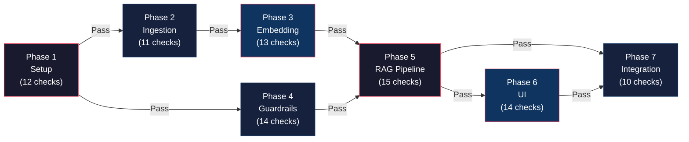

# Phase-Wise Evaluation Criteria

> Evaluation rubrics, acceptance tests, and quality gates for every phase of the HDFC Mutual Fund FAQ Assistant (RAG Chatbot), derived from the [Implementation Plan](file:///d:/NEXTLEAP%20GEN%20AI/RAG_CHATBOT/docs/implementation_plan.md).

---

## How to Use This Document

Each phase section contains:

1. **Evaluation Checklist** — binary pass/fail criteria that must all be ✅ before the phase is considered complete.
2. **Quality Metrics** — quantitative thresholds (where applicable).
3. **Test Commands** — exact commands or scripts to validate each criterion.
4. **Failure Modes** — what a failed evaluation looks like and how to remediate.

> [!IMPORTANT]
> A phase is considered **complete** only when every item in its evaluation checklist is marked ✅. Do not begin the next dependent phase until the current phase passes all evaluations.

---

## Phase 1 — Project Setup & Configuration

> **Objective:** Verify that the project foundation is correctly established, all dependencies install cleanly, and configuration files are valid.

### Evaluation Checklist

| # | Criterion | Validation Method | Pass Condition |
|---|-----------|-------------------|----------------|
| 1.1 | **Python version** | `python --version` | Output shows `3.10.x` or higher |
| 1.2 | **Virtual environment active** | `which python` (Linux/Mac) / `where python` (Windows) | Points to the project's `venv/` directory, not the system Python |
| 1.3 | **All dependencies install** | `pip install -r requirements.txt` | Exits with code `0`; no errors or version conflicts |
| 1.4 | **Directory structure matches spec** | Manual inspection or script | All directories exist: `docs/`, `data/`, `scraper/`, `embeddings/`, `pipeline/`, `ui/`, `config/`, `tests/` |
| 1.5 | **`.env` file exists with required keys** | `python -c "from dotenv import load_dotenv; load_dotenv(); import os; assert os.getenv('GROQ_API_KEY')"` | Assertion passes; key is non-empty |
| 1.6 | **`data/urls.json` is valid JSON** | `python -m json.tool data/urls.json` | Parses without errors |
| 1.7 | **`urls.json` contains 5 schemes** | `python -c "import json; d=json.load(open('data/urls.json')); assert len(d['schemes'])==5"` | Assertion passes |
| 1.8 | **All 5 URLs are reachable** | `python -c "import requests; [requests.head(s['url'], timeout=10).raise_for_status() for s in json.load(open('data/urls.json'))['schemes']]"` | All 5 URLs return HTTP 2xx or 3xx |
| 1.9 | **`config/settings.py` loads without error** | `python -c "from config.settings import *"` | No `ImportError` or `SyntaxError` |
| 1.10 | **Configuration constants are valid** | Script validation | `CHUNK_SIZE > 0`, `CHUNK_OVERLAP >= 0`, `TOP_K >= 1`, `0 < SIMILARITY_THRESHOLD <= 1.0`, `LLM_TEMPERATURE >= 0` |
| 1.11 | **Git initialized** | `git status` | Not an error; `.gitignore` exists and contains `.env`, `data/`, `__pycache__/` |
| 1.12 | **`.env` is git-ignored** | `git check-ignore .env` | Outputs `.env` (file is ignored) |

### Test Script

```bash
# Phase 1 evaluation script
echo "=== Phase 1 Evaluation ==="

echo "[1.1] Python version..."
python --version 2>&1 | grep -E "3\.(1[0-9]|[2-9][0-9])" && echo "✅ PASS" || echo "❌ FAIL"

echo "[1.3] Installing dependencies..."
pip install -r requirements.txt --quiet && echo "✅ PASS" || echo "❌ FAIL"

echo "[1.6] Validating urls.json..."
python -m json.tool data/urls.json > /dev/null 2>&1 && echo "✅ PASS" || echo "❌ FAIL"

echo "[1.7] Checking scheme count..."
python -c "import json; d=json.load(open('data/urls.json')); assert len(d['schemes'])==5; print('✅ PASS')" 2>&1 || echo "❌ FAIL"

echo "[1.9] Loading config..."
python -c "from config.settings import *; print('✅ PASS')" 2>&1 || echo "❌ FAIL"

echo "[1.11] Git status..."
git status > /dev/null 2>&1 && echo "✅ PASS" || echo "❌ FAIL"

echo "[1.12] .env ignored..."
git check-ignore .env > /dev/null 2>&1 && echo "✅ PASS" || echo "❌ FAIL"
```

### Failure Modes

| Failure | Symptom | Remediation |
|---------|---------|-------------|
| Wrong Python version | `ModuleNotFoundError` for `match` statements, type hints | Install Python 3.10+ via `pyenv` or system installer |
| Dependency conflict | `pip` error showing version incompatibility | Pin exact versions in `requirements.txt`; resolve with `pip install --force-reinstall` |
| Missing API key | `GROQ_API_KEY` is `None` at runtime | Copy `.env.example` to `.env` and populate the key |
| URL unreachable | `ConnectionError` or HTTP 403 | Verify URL in a browser; check network/firewall; Groww may have changed the URL slug |

---

## Phase 2 — Data Ingestion (Web Scraping & Preprocessing)

> **Objective:** Verify that all 5 Groww scheme pages are scraped, cleaned, and saved as structured JSON files.

### Evaluation Checklist

| # | Criterion | Validation Method | Pass Condition |
|---|-----------|-------------------|----------------|
| 2.1 | **Scraper fetches all 5 URLs** | Run `groww_scraper.scrape_all_schemes()` | No exceptions; 5 raw HTML files exist in `data/raw/groww/` |
| 2.2 | **Raw HTML files are non-empty** | `ls -la data/raw/groww/` | Each file is > 10 KB (a valid Groww page is typically 50–200 KB) |
| 2.3 | **Rate limiting works** | Observe scraper logs | Minimum 1-second delay between consecutive requests |
| 2.4 | **Retry logic activates on failure** | Mock a 500 response; observe logs | Scraper retries up to `n` times with backoff before failing |
| 2.5 | **Processed JSON files exist** | `ls data/processed/` | Exactly 5 JSON files, one per scheme |
| 2.6 | **Each JSON has required fields** | Schema validation | Each file contains: `scheme_name`, `category`, `source_url`, `scrape_date`, `content` (non-empty) |
| 2.7 | **Key financial data is extracted** | Spot-check each JSON | At least 3 of these fields are present per scheme: `expense_ratio`, `exit_load`, `nav`, `aum`, `min_sip_amount` |
| 2.8 | **HTML tags are stripped** | `grep -c "<" data/processed/*.json` | No raw HTML tags (`<div>`, `<span>`, etc.) in the `content` field |
| 2.9 | **Metadata is attached** | Inspect JSON | Every file has `source_url`, `scheme_name`, `scrape_date` in metadata |
| 2.10 | **Deduplication works** | Compare content sections | No identical text blocks appear across multiple JSON files (excluding shared AMC-level boilerplate) |
| 2.11 | **Unit tests pass** | `pytest tests/test_scraper.py -v` | All tests pass with 0 failures |

### Quality Metrics

| Metric | Threshold | Measurement |
|--------|-----------|-------------|
| **Scrape success rate** | 100% (5/5 URLs) | Count of successfully scraped URLs |
| **Data extraction completeness** | ≥ 80% of expected fields populated per scheme | Count non-null fields / total expected fields |
| **Raw HTML size** | > 10 KB per file | File size of each raw HTML |
| **Processed JSON size** | > 1 KB per file | File size of each processed JSON |
| **Scrape duration** | < 60 seconds for all 5 URLs | Wall-clock time of `scrape_all_schemes()` |

### Test Script

```bash
echo "=== Phase 2 Evaluation ==="

echo "[2.1] Running scraper..."
python -c "from scraper.groww_scraper import GrowwScraper; s=GrowwScraper(); s.scrape_all_schemes()" && echo "✅ PASS" || echo "❌ FAIL"

echo "[2.2] Checking raw HTML files..."
RAW_COUNT=$(ls data/raw/groww/*.html 2>/dev/null | wc -l)
[ "$RAW_COUNT" -eq 5 ] && echo "✅ PASS ($RAW_COUNT files)" || echo "❌ FAIL ($RAW_COUNT files, expected 5)"

echo "[2.5] Checking processed JSON files..."
PROC_COUNT=$(ls data/processed/*.json 2>/dev/null | wc -l)
[ "$PROC_COUNT" -eq 5 ] && echo "✅ PASS ($PROC_COUNT files)" || echo "❌ FAIL ($PROC_COUNT files, expected 5)"

echo "[2.8] Checking for HTML tags in processed files..."
TAG_COUNT=$(grep -rl "<div\|<span\|<table\|<script" data/processed/ 2>/dev/null | wc -l)
[ "$TAG_COUNT" -eq 0 ] && echo "✅ PASS (no HTML tags)" || echo "❌ FAIL ($TAG_COUNT files contain HTML tags)"

echo "[2.11] Running unit tests..."
pytest tests/test_scraper.py -v && echo "✅ PASS" || echo "❌ FAIL"
```

### Failure Modes

| Failure | Symptom | Remediation |
|---------|---------|-------------|
| Groww blocks scraper | HTTP 403 / CAPTCHA page in raw HTML | Switch to Selenium with headless Chrome; add randomized User-Agent headers |
| JS-rendered content missing | Parsed JSON has empty fields for NAV, AUM | Use Selenium with explicit waits instead of `requests` + `BeautifulSoup` |
| Layout change breaks parser | `KeyError` or empty `content` field | Inspect the current Groww DOM; update CSS selectors in `groww_scraper.py` |
| Deduplication too aggressive | Legitimate content removed | Tune dedup hash granularity; use paragraph-level hashing instead of full-document |

---

## Phase 3 — Embedding & Vector Store

> **Objective:** Verify that text is chunked correctly, embeddings are generated, and ChromaDB is populated and queryable.

### Evaluation Checklist

| # | Criterion | Validation Method | Pass Condition |
|---|-----------|-------------------|----------------|
| 3.1 | **Chunker produces valid chunks** | Run chunker on all 5 processed JSONs | At least 1 chunk per file; no empty chunks |
| 3.2 | **Chunk size is within bounds** | Measure token count per chunk | All chunks are ≤ `CHUNK_SIZE` (500) tokens |
| 3.3 | **Chunk overlap is correct** | Compare end of chunk N with start of chunk N+1 | Overlapping region ≈ `CHUNK_OVERLAP` (50) tokens |
| 3.4 | **Metadata is preserved per chunk** | Inspect chunk metadata | Every chunk has: `chunk_id`, `source_url`, `scheme_name`, `section_heading`, `scrape_date` |
| 3.5 | **Embedding model loads** | `from sentence_transformers import SentenceTransformer; m=SentenceTransformer('BAAI/bge-small-en-v1.5')` | No errors; model is loaded |
| 3.6 | **Embeddings are 384-dimensional** | `assert m.encode(["test"]).shape[1] == 384` | Assertion passes |
| 3.7 | **ChromaDB collection is created** | Query ChromaDB for collection info | Collection `hdfc_mutual_funds` exists |
| 3.8 | **All chunks are stored** | `collection.count()` | Count matches the total number of chunks generated in step 3.1 |
| 3.9 | **No duplicate chunk IDs** | `len(set(ids)) == len(ids)` | All `chunk_id` values are unique |
| 3.10 | **Sample query returns results** | Query "expense ratio HDFC Large Cap" | At least 1 result with cosine similarity > 0.5 |
| 3.11 | **Similarity threshold filters correctly** | Query with a nonsense string ("asdfghjkl") | 0 results above `SIMILARITY_THRESHOLD` (0.65) |
| 3.12 | **Persistence works** | Restart Python; reload ChromaDB from disk | `collection.count()` returns the same count as before restart |
| 3.13 | **Unit tests pass** | `pytest tests/test_chunker.py -v` | All tests pass |

### Quality Metrics

| Metric | Threshold | Measurement |
|--------|-----------|-------------|
| **Total chunks generated** | 20–100 (for 5 schemes) | `collection.count()` |
| **Average chunk size** | 300–500 tokens | Mean token count across all chunks |
| **Empty chunk rate** | 0% | Count of chunks with empty/whitespace-only text |
| **Embedding generation time** | < 30 seconds for all chunks | Wall-clock time |
| **ChromaDB disk size** | < 100 MB | Size of `data/chroma_db/` directory |
| **Sample query relevance** | Top-1 result similarity ≥ 0.70 for known factual queries | Cosine similarity score |

### Test Script

```bash
echo "=== Phase 3 Evaluation ==="

echo "[3.5] Loading embedding model..."
python -c "
from sentence_transformers import SentenceTransformer
m = SentenceTransformer('BAAI/bge-small-en-v1.5')
emb = m.encode(['test'])
assert emb.shape[1] == 384, f'Expected 384 dims, got {emb.shape[1]}'
print('✅ PASS (384-dim embeddings)')
" || echo "❌ FAIL"

echo "[3.7-3.8] Checking ChromaDB collection..."
python -c "
import chromadb
client = chromadb.PersistentClient(path='./data/chroma_db')
col = client.get_collection('hdfc_mutual_funds')
count = col.count()
assert count > 0, 'Collection is empty'
print(f'✅ PASS ({count} chunks stored)')
" || echo "❌ FAIL"

echo "[3.10] Sample query test..."
python -c "
from embeddings.vector_store import VectorStore
vs = VectorStore()
results = vs.search('expense ratio HDFC Large Cap', top_k=3)
assert len(results) > 0, 'No results returned'
print(f'✅ PASS ({len(results)} results)')
" || echo "❌ FAIL"

echo "[3.13] Running unit tests..."
pytest tests/test_chunker.py -v && echo "✅ PASS" || echo "❌ FAIL"
```

### Failure Modes

| Failure | Symptom | Remediation |
|---------|---------|-------------|
| Model download fails | `OSError` from HuggingFace | Check internet; pre-download model to a local cache; set `HF_HOME` env var |
| Dimension mismatch | ChromaDB rejects embeddings | Drop and recreate the collection; ensure the same model is used for ingestion and queries |
| ChromaDB corruption | `sqlite3.DatabaseError` on load | Delete `data/chroma_db/`; re-run the full ingestion pipeline |
| Too few chunks | Collection has < 10 chunks | Check preprocessor output; verify chunks are not being filtered too aggressively |

---

## Phase 4 — Guardrails & Query Classification

> **Objective:** Verify that PII is detected, advisory queries are refused, and query classification is accurate.

### Evaluation Checklist

| # | Criterion | Validation Method | Pass Condition |
|---|-----------|-------------------|----------------|
| 4.1 | **PAN detection works** | Test with `"My PAN is ABCDE1234F"` | Returns `PII_DETECTED` |
| 4.2 | **Aadhaar detection works** | Test with `"Aadhaar: 1234 5678 9012"` | Returns `PII_DETECTED` |
| 4.3 | **Phone detection works** | Test with `"Call me at +919876543210"` | Returns `PII_DETECTED` |
| 4.4 | **Email detection works** | Test with `"Email: user@example.com"` | Returns `PII_DETECTED` |
| 4.5 | **Clean query passes PII check** | Test with `"What is the expense ratio?"` | Does **not** return `PII_DETECTED` |
| 4.6 | **Advisory query is refused** | Test with `"Should I invest in HDFC Large Cap?"` | Returns `ADVISORY` |
| 4.7 | **Comparison query is refused** | Test with `"Which is better — Large Cap or Mid Cap?"` | Returns `COMPARISON` |
| 4.8 | **Factual query passes** | Test with `"What is the NAV of HDFC Mid Cap Fund?"` | Returns `FACTUAL` |
| 4.9 | **Out-of-scope query detected** | Test with `"What is the weather today?"` | Returns `OUT_OF_SCOPE` |
| 4.10 | **Refusal responses contain links** | Inspect advisory refusal output | Contains AMFI / factsheet educational link |
| 4.11 | **PII block contains privacy notice** | Inspect PII block output | Contains privacy notice text |
| 4.12 | **All advisory keywords trigger refusal** | Iterate over `ADVISORY_KEYWORDS` list | Every keyword triggers `ADVISORY` classification |
| 4.13 | **LLM fallback handles ambiguity** | Test with `"Is this fund worth looking at?"` | LLM fallback classifies as `ADVISORY` |
| 4.14 | **Unit tests pass** | `pytest tests/test_classifier.py tests/test_guardrails.py -v` | All tests pass |

### Quality Metrics

| Metric | Threshold | Measurement |
|--------|-----------|-------------|
| **PII detection precision** | ≥ 95% | True positives / (True positives + False positives) on a 50-query test set |
| **PII detection recall** | 100% (zero false negatives) | True positives / (True positives + False negatives) — PII must **never** slip through |
| **Advisory detection accuracy** | ≥ 90% | Correct classifications / total advisory test cases |
| **Factual query pass-through rate** | ≥ 95% | Factual queries correctly classified as `FACTUAL` |
| **Classification latency** | < 100 ms (rule-based), < 2s (LLM fallback) | Wall-clock time per classification |

### Test Dataset

```python
# Minimum test dataset for Phase 4 evaluation
EVAL_QUERIES = [
    # PII — must ALL be blocked
    {"query": "My PAN is ABCDE1234F", "expected": "PII_DETECTED"},
    {"query": "Aadhaar 1234 5678 9012", "expected": "PII_DETECTED"},
    {"query": "Contact me at 9876543210", "expected": "PII_DETECTED"},
    {"query": "Send to user@example.com", "expected": "PII_DETECTED"},
    {"query": "My PAN is ABCDE1234F and my email is a@b.com", "expected": "PII_DETECTED"},

    # Advisory — must ALL be refused
    {"query": "Should I invest in HDFC Large Cap Fund?", "expected": "ADVISORY"},
    {"query": "Recommend me a good fund", "expected": "ADVISORY"},
    {"query": "Is HDFC Mid Cap a good buy?", "expected": "ADVISORY"},
    {"query": "Will HDFC Small Cap grow in 2027?", "expected": "ADVISORY"},
    {"query": "What is the best HDFC fund?", "expected": "ADVISORY"},

    # Comparison — must be refused
    {"query": "Which is better — Large Cap or Mid Cap?", "expected": "COMPARISON"},
    {"query": "Compare HDFC Large Cap vs Mid Cap returns", "expected": "COMPARISON"},

    # Factual — must PASS through
    {"query": "What is the expense ratio of HDFC Large Cap Fund?", "expected": "FACTUAL"},
    {"query": "What is the NAV of HDFC Mid Cap Fund?", "expected": "FACTUAL"},
    {"query": "What is the exit load for HDFC Small Cap Fund?", "expected": "FACTUAL"},
    {"query": "What is the minimum SIP amount for HDFC Gold ETF FoF?", "expected": "FACTUAL"},
    {"query": "What is the AUM of HDFC Silver ETF FoF?", "expected": "FACTUAL"},

    # Out of scope — must be redirected
    {"query": "What is the weather today?", "expected": "OUT_OF_SCOPE"},
    {"query": "Who is the Prime Minister of India?", "expected": "OUT_OF_SCOPE"},
    {"query": "Tell me a joke", "expected": "OUT_OF_SCOPE"},
]
```

### Failure Modes

| Failure | Symptom | Remediation |
|---------|---------|-------------|
| PII false negative | PAN/Aadhaar slips through to retrieval | Fix regex; add word-boundary anchors; add missing patterns |
| PII false positive | "HDFC Large Cap Fund" blocked as PII | Whitelist known fund names; add context-aware checks |
| Advisory false negative | "Is this fund worth it?" passes as `FACTUAL` | Add "worth it" to `ADVISORY_KEYWORDS`; improve LLM fallback prompt |
| Factual query blocked | "What is the expense ratio?" classified as `ADVISORY` due to substring match | Ensure keyword matching uses whole-word matching, not substring |

---

## Phase 5 — RAG Query Pipeline

> **Objective:** Verify the end-to-end retrieval → prompt building → LLM generation → response formatting pipeline.

### Evaluation Checklist

| # | Criterion | Validation Method | Pass Condition |
|---|-----------|-------------------|----------------|
| 5.1 | **Retriever returns relevant chunks** | Query "expense ratio HDFC Large Cap" | Top-1 chunk contains "expense ratio" text from the HDFC Large Cap scheme |
| 5.2 | **Top-K is respected** | Query any valid question | Returns at most `TOP_K` (3) results |
| 5.3 | **Similarity threshold filters correctly** | Query with a gibberish string | Returns 0 chunks (all below 0.65 threshold) |
| 5.4 | **Prompt builder assembles 3-part prompt** | Inspect the assembled prompt | Contains system prompt, context section with chunks, and user query section |
| 5.5 | **System prompt is unchanged** | Compare assembled system prompt to `config/prompts.py` | Exact match |
| 5.6 | **Groq API call succeeds** | Send a test prompt to Groq | Returns a non-empty text response |
| 5.7 | **LLM temperature is 0.1** | Inspect API call parameters | `temperature=0.1` in the request |
| 5.8 | **LLM max tokens is 200** | Inspect API call parameters | `max_tokens=200` in the request |
| 5.9 | **Response is ≤ 3 sentences** | Count sentences in the formatted response | Sentence count ≤ 3 |
| 5.10 | **Citation URL is present** | Inspect the formatted response | `citation` field contains a valid Groww URL |
| 5.11 | **Footer is present** | Inspect the formatted response | `footer` field contains `"Last updated from sources: <date>"` |
| 5.12 | **No advisory language in output** | Scan response for advisory keywords | Zero matches against `ADVISORY_KEYWORDS` |
| 5.13 | **Fallback model works** | Mock primary model failure; trigger fallback | Response is generated using `gemma2-9b-it` |
| 5.14 | **Empty context handling** | Pass empty context to the prompt builder | LLM responds with "I don't have this information in my current sources" |
| 5.15 | **Unit tests pass** | `pytest tests/test_retriever.py -v` | All tests pass |

### Quality Metrics

| Metric | Threshold | Measurement |
|--------|-----------|-------------|
| **Retrieval relevance (MRR@3)** | ≥ 0.70 | Mean Reciprocal Rank across the 10-query eval set |
| **Answer accuracy** | ≥ 90% | Factually correct answers / total factual queries (manual evaluation) |
| **Response compliance rate** | 100% | Percentage of responses that have ≤ 3 sentences, 1 citation, and a footer |
| **End-to-end latency** | < 3 seconds | Wall-clock time from query input to formatted response output |
| **LLM token usage** | ≤ 200 output tokens per response | Groq API usage data |
| **Hallucination rate** | 0% | Answers containing facts not present in the retrieved context chunks |

### Evaluation Query Set

| # | Query | Expected Answer Contains | Expected Citation Scheme |
|---|-------|-------------------------|--------------------------|
| 1 | "What is the expense ratio of HDFC Large Cap Fund?" | A percentage value (e.g., "1.08%") | HDFC Large Cap |
| 2 | "What is the exit load for HDFC Small Cap Fund?" | Exit load terms (e.g., "1% if redeemed within 1 year") | HDFC Small Cap |
| 3 | "What is the minimum SIP amount for HDFC Mid Cap Fund?" | A rupee amount (e.g., "₹500" or "₹100") | HDFC Mid Cap |
| 4 | "What is the NAV of HDFC Gold ETF FoF?" | A numeric NAV value | HDFC Gold ETF FoF |
| 5 | "What is the AUM of HDFC Silver ETF FoF?" | An AUM value in crores | HDFC Silver ETF FoF |
| 6 | "What is the benchmark index of HDFC Large Cap Fund?" | An index name (e.g., "Nifty 100") | HDFC Large Cap |
| 7 | "What is the riskometer rating of HDFC Small Cap Fund?" | A risk category (e.g., "Very High") | HDFC Small Cap |
| 8 | "Who is the fund manager of HDFC Mid Cap Fund?" | A person's name | HDFC Mid Cap |

### Test Script

```bash
echo "=== Phase 5 Evaluation ==="

echo "[5.6] Testing Groq API connection..."
python -c "
from groq import Groq
import os
from dotenv import load_dotenv
load_dotenv()
client = Groq(api_key=os.getenv('GROQ_API_KEY'))
response = client.chat.completions.create(
    model='llama-3.3-70b-versatile',
    messages=[{'role': 'user', 'content': 'Say hello'}],
    temperature=0.1,
    max_tokens=50
)
assert response.choices[0].message.content, 'Empty response'
print('✅ PASS (Groq API connected)')
" || echo "❌ FAIL"

echo "[5.1-5.3] Testing retriever..."
python -c "
from pipeline.retriever import retrieve
results = retrieve('expense ratio HDFC Large Cap')
assert len(results) > 0, 'No results returned'
assert len(results) <= 3, f'Too many results: {len(results)}'
print(f'✅ PASS ({len(results)} results, top similarity: {results[0][\"similarity\"]:.3f})')
" || echo "❌ FAIL"

echo "[5.15] Running unit tests..."
pytest tests/test_retriever.py -v && echo "✅ PASS" || echo "❌ FAIL"
```

### Failure Modes

| Failure | Symptom | Remediation |
|---------|---------|-------------|
| Low retrieval relevance | Top-1 chunk is irrelevant to the query | Tune `CHUNK_SIZE`; try `bge-base-en-v1.5` for better accuracy; add reranking |
| LLM hallucination | Response contains facts not in context | Strengthen system prompt; add post-generation fact-checking; lower temperature |
| Response exceeds 3 sentences | Formatter fails to truncate | Debug `truncate_to_sentences()`; handle edge cases (lists, bullet points) |
| Latency > 3 seconds | Groq API response is slow | Check Groq API status; try the lighter `gemma2-9b-it` model; add caching |

---

## Phase 6 — User Interface (Streamlit Chat)

> **Objective:** Verify that the Streamlit chat UI is functional, branded, and meets all UX requirements.

### Evaluation Checklist

| # | Criterion | Validation Method | Pass Condition |
|---|-----------|-------------------|----------------|
| 6.1 | **App starts without errors** | `streamlit run ui/app.py` | No errors in terminal; browser opens the app |
| 6.2 | **Header displays correctly** | Visual inspection | "🏦 HDFC Mutual Fund FAQ Assistant" title is visible |
| 6.3 | **Disclaimer banner is visible** | Visual inspection | Yellow/amber `st.warning()` banner with "Facts-only. No investment advice." is always visible |
| 6.4 | **Disclaimer persists on scroll** | Scroll through chat history | Disclaimer remains visible (fixed or at top) |
| 6.5 | **3 example questions are displayed** | Visual inspection | Three clickable buttons/links with pre-filled example queries |
| 6.6 | **Clicking an example fills the input** | Click each example button | The query is sent and a response is generated |
| 6.7 | **Chat input is functional** | Type a query and press Enter | Query appears as a user message; response appears as an assistant message |
| 6.8 | **User messages are styled distinctly** | Visual inspection | User messages and assistant messages have visually different styling (alignment, color, icon) |
| 6.9 | **Citation link is clickable** | Click the citation URL in a response | Opens the Groww scheme page in a new tab |
| 6.10 | **Footer is displayed per response** | Visual inspection | "Last updated from sources: `<date>`" appears below each assistant response |
| 6.11 | **Chat history is maintained in session** | Ask 3 questions sequentially | All 3 Q&A pairs remain visible in the chat |
| 6.12 | **Custom CSS loads** | Inspect browser dev tools | `ui/styles.css` is applied; custom fonts/colors are visible |
| 6.13 | **Loading indicator appears** | Submit a query; observe | A spinner or "Generating..." message appears while waiting for the response |
| 6.14 | **Empty input is handled** | Submit with no text | No crash; either the send is blocked or a prompt to enter a question is shown |

### Quality Metrics

| Metric | Threshold | Measurement |
|--------|-----------|-------------|
| **Time to first paint** | < 3 seconds | Browser load time for the initial page |
| **Response display latency** | < 4 seconds | Time from query submission to response appearing in the chat |
| **UI responsiveness** | No frozen frames | Interact with the app while a query is processing; UI should remain responsive |
| **Mobile responsiveness** | Usable on 375px–768px viewport | Resize browser; elements should not overflow or become unreadable |

### Manual Test Checklist

> [!NOTE]
> Phase 6 evaluation is primarily **manual** since Streamlit UIs cannot be easily unit-tested. Use this checklist during manual QA.

```
[ ] App loads in < 3 seconds
[ ] Header, disclaimer, example questions all visible on initial load
[ ] Example question 1: "What is the expense ratio of HDFC Large Cap Fund?" → factual response
[ ] Example question 2: "What is the exit load for HDFC Small Cap Fund?" → factual response
[ ] Example question 3: "What is the minimum SIP amount for HDFC Mid Cap Fund?" → factual response
[ ] Type a custom factual query → correct response with citation + footer
[ ] Type an advisory query → polite refusal
[ ] Type a PII-containing query → immediate block with privacy notice
[ ] Type an out-of-scope query → polite redirection
[ ] Submit an empty query → no crash, graceful handling
[ ] Send 5+ queries → chat history is preserved
[ ] Citation link is clickable and opens Groww page
[ ] Loading spinner appears during response generation
[ ] Page refresh → chat resets, welcome screen appears
[ ] Custom CSS is applied (HDFC branding, colors, fonts)
```

### Failure Modes

| Failure | Symptom | Remediation |
|---------|---------|-------------|
| App crashes on start | `StreamlitAPIException` or `ModuleNotFoundError` | Check `ui/app.py` imports; ensure all pipeline modules are on the Python path |
| No response generated | Query is sent but no assistant message appears | Check pipeline integration; verify Groq API key; inspect Streamlit logs |
| CSS not applied | Default Streamlit styling with no branding | Verify `ui/styles.css` path in `st.markdown()`; check CSS syntax |
| Example buttons broken | Clicking does nothing | Check `st.button()` callback wiring; verify `st.session_state` usage |

---

## Phase 7 — Integration, Testing & Documentation

> **Objective:** Verify the fully integrated system passes all test scenarios, and documentation is complete.

### Evaluation Checklist

| # | Criterion | Validation Method | Pass Condition |
|---|-----------|-------------------|----------------|
| 7.1 | **`main.py` runs without errors** | `python main.py` or `streamlit run main.py` | Application starts successfully; all components initialize |
| 7.2 | **All 10 test scenarios pass** | Run each scenario manually or via script | Results match the expected outcomes (see table below) |
| 7.3 | **All unit tests pass** | `pytest tests/ -v` | 0 failures across all test files |
| 7.4 | **No import errors across modules** | `python -c "import scraper, embeddings, pipeline, ui, config"` | No `ModuleNotFoundError` |
| 7.5 | **README.md exists and is complete** | Visual inspection | Contains: setup instructions, architecture overview, how to run, known limitations |
| 7.6 | **README has setup instructions** | Follow the README as a new user | A new contributor can set up the project from scratch using only the README |
| 7.7 | **All documentation files present** | `ls docs/` | `problemStatement.md`, `Architecture.md`, `implementation_plan.md`, `edge-case.md`, `eval.md` |
| 7.8 | **Response latency < 3 seconds** | Time 10 factual queries | Average latency < 3s; P95 latency < 5s |
| 7.9 | **No PII leakage in any scenario** | Run all PII test queries | Every PII query is blocked; no PII reaches the LLM or the response |
| 7.10 | **No advisory content in any response** | Run all factual queries; scan responses | Zero instances of advisory language in any generated response |

### The 10 Mandatory Test Scenarios

| # | Test Query | Expected Classification | Expected Response |
|---|-----------|------------------------|-------------------|
| 1 | "What is the expense ratio of HDFC Large Cap Fund?" | `FACTUAL` | ✅ Factual answer with citation + footer |
| 2 | "What is the exit load for HDFC Small Cap Fund?" | `FACTUAL` | ✅ Factual answer with citation + footer |
| 3 | "Should I invest in HDFC Mid Cap Fund?" | `ADVISORY` | 🚫 Polite refusal + AMFI link |
| 4 | "Which fund is better — Large Cap or Mid Cap?" | `COMPARISON` | 🚫 Polite refusal + factsheet links |
| 5 | "My PAN is ABCDE1234F" | `PII_DETECTED` | 🚫 Immediate block + privacy notice |
| 6 | "What is the weather today?" | `OUT_OF_SCOPE` | 🔄 Out-of-scope redirection |
| 7 | "What is the minimum SIP for HDFC Gold ETF FoF?" | `FACTUAL` | ✅ Factual answer with citation + footer |
| 8 | "Tell me about HDFC Silver ETF FoF riskometer" | `FACTUAL` | ✅ Factual answer with citation + footer |
| 9 | "Recommend me a good mutual fund" | `ADVISORY` | 🚫 Polite refusal |
| 10 | *(empty query)* | N/A | ⚠️ Graceful handling (no crash) |

### Full Evaluation Script

```bash
echo "=== Phase 7 — Full System Evaluation ==="
echo ""

echo "─────────────────────────────────────"
echo "[7.3] Running ALL unit tests..."
echo "─────────────────────────────────────"
pytest tests/ -v --tb=short
TEST_EXIT=$?
[ $TEST_EXIT -eq 0 ] && echo "✅ ALL TESTS PASSED" || echo "❌ TESTS FAILED (exit code: $TEST_EXIT)"
echo ""

echo "─────────────────────────────────────"
echo "[7.4] Checking module imports..."
echo "─────────────────────────────────────"
python -c "
import importlib
modules = ['config.settings', 'config.prompts', 'scraper.base_scraper', 'scraper.groww_scraper',
           'embeddings.chunker', 'embeddings.embedder', 'embeddings.vector_store',
           'pipeline.query_classifier', 'pipeline.guardrails', 'pipeline.retriever',
           'pipeline.prompt_builder', 'pipeline.generator', 'pipeline.response_formatter']
failed = []
for mod in modules:
    try:
        importlib.import_module(mod)
    except Exception as e:
        failed.append(f'{mod}: {e}')
if failed:
    print('❌ IMPORT FAILURES:')
    for f in failed: print(f'   - {f}')
else:
    print(f'✅ All {len(modules)} modules imported successfully')
"
echo ""

echo "─────────────────────────────────────"
echo "[7.2] Running 10 test scenarios..."
echo "─────────────────────────────────────"
python -c "
from pipeline.query_classifier import classify
from pipeline.guardrails import check_pii

test_cases = [
    ('What is the expense ratio of HDFC Large Cap Fund?', 'FACTUAL'),
    ('What is the exit load for HDFC Small Cap Fund?', 'FACTUAL'),
    ('Should I invest in HDFC Mid Cap Fund?', 'ADVISORY'),
    ('Which fund is better — Large Cap or Mid Cap?', 'COMPARISON'),
    ('My PAN is ABCDE1234F', 'PII_DETECTED'),
    ('What is the weather today?', 'OUT_OF_SCOPE'),
    ('What is the minimum SIP for HDFC Gold ETF FoF?', 'FACTUAL'),
    ('Tell me about HDFC Silver ETF FoF riskometer', 'FACTUAL'),
    ('Recommend me a good mutual fund', 'ADVISORY'),
    ('', 'EMPTY'),
]

passed = 0
for i, (query, expected) in enumerate(test_cases, 1):
    try:
        if not query.strip():
            result = 'EMPTY'
        elif check_pii(query):
            result = 'PII_DETECTED'
        else:
            result = classify(query)
        status = '✅' if result == expected else '❌'
        if result == expected:
            passed += 1
        print(f'  {status} Test {i:2d}: [{result:13s}] {query[:60]}')
    except Exception as e:
        print(f'  ❌ Test {i:2d}: ERROR — {e}')

print(f'\nResults: {passed}/{len(test_cases)} passed')
"
echo ""

echo "─────────────────────────────────────"
echo "[7.7] Checking documentation files..."
echo "─────────────────────────────────────"
DOCS=("docs/problemStatement.md" "docs/Architecture.md" "docs/implementation_plan.md" "docs/edge-case.md" "docs/eval.md" "README.md")
ALL_PRESENT=true
for doc in "${DOCS[@]}"; do
    if [ -f "$doc" ]; then
        echo "  ✅ $doc"
    else
        echo "  ❌ $doc (MISSING)"
        ALL_PRESENT=false
    fi
done
$ALL_PRESENT && echo "✅ All documentation present" || echo "❌ Some documents missing"
echo ""

echo "=== Evaluation Complete ==="
```

### Quality Metrics

| Metric | Threshold | Measurement |
|--------|-----------|-------------|
| **Unit test pass rate** | 100% | `pytest` output |
| **10-scenario pass rate** | 100% (10/10) | Script output |
| **Average response latency** | < 3 seconds | Mean of 10 factual queries |
| **P95 response latency** | < 5 seconds | 95th percentile across all queries |
| **Factual accuracy** | ≥ 90% | Manual verification of 8 factual answers |
| **Compliance rate** | 100% | All responses have ≤ 3 sentences, citation, footer |
| **PII leakage rate** | 0% | No PII detected in any response |
| **Advisory leakage rate** | 0% | No advisory language in any factual response |

### Failure Modes

| Failure | Symptom | Remediation |
|---------|---------|-------------|
| Import cycle | `ImportError: circular import` | Refactor module dependencies; use lazy imports |
| Test scenario fails | Classification mismatch | Debug the classifier; add missing keywords or adjust LLM fallback prompt |
| Latency exceeds target | Mean > 3s per query | Profile pipeline; cache embeddings; use a lighter LLM model |
| README incomplete | New contributor can't set up the project | Add missing setup steps; test with a fresh environment |

---

## Overall Evaluation Summary



| Phase | Checks | Critical Criteria | Gate Blocker |
|-------|--------|-------------------|--------------|
| **Phase 1** | 12 | Dependencies install, `.env` configured, `urls.json` valid | Cannot proceed without a working environment |
| **Phase 2** | 11 | 5 URLs scraped, 5 JSONs produced, key financial data present | No data → nothing to embed |
| **Phase 3** | 13 | Chunks generated, embeddings stored, ChromaDB queryable | No vector store → no retrieval |
| **Phase 4** | 14 | PII recall = 100%, advisory detection ≥ 90%, factual pass-through ≥ 95% | PII leakage is a compliance failure |
| **Phase 5** | 15 | Groq API works, responses comply (≤ 3 sentences + citation + footer), accuracy ≥ 90% | Non-compliant responses violate the problem statement |
| **Phase 6** | 14 | App starts, disclaimer visible, example questions work, chat functional | Broken UI = unusable product |
| **Phase 7** | 10 | 10/10 scenarios pass, all unit tests green, README complete | Ship-readiness gate |

> **Total evaluation criteria: 89 checks across 7 phases.**

> [!TIP]
> Run the Phase 7 full evaluation script as a **smoke test** before every demo or submission. It validates the entire system in under 2 minutes.
