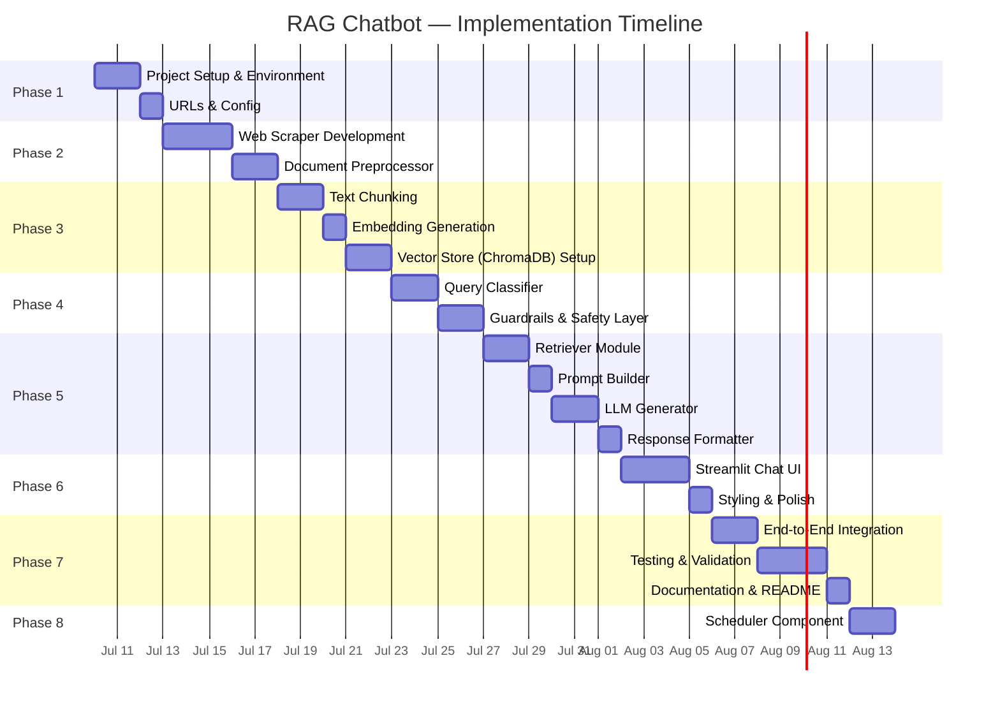
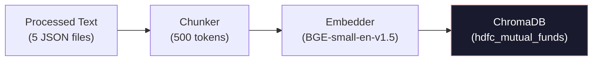
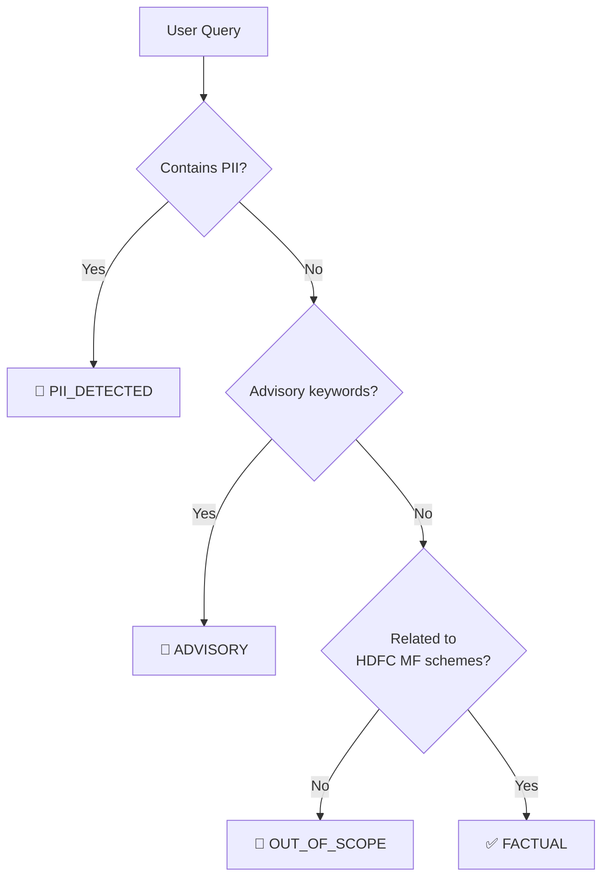
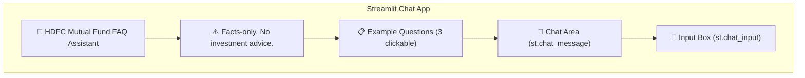
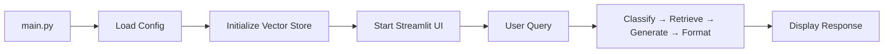
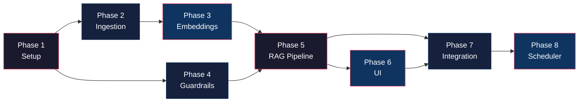

# Phase-Wise Implementation Plan

> Step-by-step implementation roadmap for the HDFC Mutual Fund FAQ Assistant (RAG Chatbot), derived from the [Architecture](file:///d:/NEXTLEAP%20GEN%20AI/RAG_CHATBOT/docs/Architecture.md) document.

---

## Timeline Overview



---

## Phase 1 — Project Setup & Configuration

> **Goal:** Establish the project foundation, install dependencies, and define source URLs.

### 1.1 Environment Setup

| Task | Details |
|---|---|
| Initialize Python project | Python 3.10+, virtual environment (`venv`) |
| Create project directory structure | As defined in [Architecture §3](file:///d:/NEXTLEAP%20GEN%20AI/RAG_CHATBOT/docs/Architecture.md) |
| Install core dependencies | `requirements.txt` with initial packages |
| Set up `.env` file | API key for Groq |
| Initialize Git repository | `.gitignore` for `.env`, `data/`, `__pycache__/` |

**`requirements.txt` (initial):**

```txt
# Web Scraping
requests
beautifulsoup4
selenium
webdriver-manager

# Text Processing
langchain
langchain-text-splitters

# Embeddings & Vector Store
sentence-transformers
chromadb

# LLM
groq                       # Groq LLM API client

# UI
streamlit

# Utilities
python-dotenv
pytest
```

### 1.2 Source URL Configuration

Create `data/urls.json` — the single source of truth for all Groww URLs:

```json
{
  "amc": "HDFC Mutual Fund",
  "schemes": [
    {
      "name": "HDFC Large Cap Fund – Direct Growth",
      "category": "Large Cap",
      "url": "https://groww.in/mutual-funds/hdfc-large-cap-fund-direct-growth"
    },
    {
      "name": "HDFC Mid Cap Fund – Direct Growth",
      "category": "Mid Cap",
      "url": "https://groww.in/mutual-funds/hdfc-mid-cap-fund-direct-growth"
    },
    {
      "name": "HDFC Small Cap Fund – Direct Growth",
      "category": "Small Cap",
      "url": "https://groww.in/mutual-funds/hdfc-small-cap-fund-direct-growth"
    },
    {
      "name": "HDFC Gold ETF Fund of Fund – Direct Growth",
      "category": "Gold (Commodity)",
      "url": "https://groww.in/mutual-funds/hdfc-gold-etf-fund-of-fund-direct-plan-growth"
    },
    {
      "name": "HDFC Silver ETF FoF – Direct Growth",
      "category": "Silver (Commodity)",
      "url": "https://groww.in/mutual-funds/hdfc-silver-etf-fof-direct-growth"
    }
  ],
  "last_updated": null
}
```

### 1.3 Configuration Module

Create `config/settings.py` with all configurable constants:

```python
# Chunking
CHUNK_SIZE = 500
CHUNK_OVERLAP = 50

# Retrieval
TOP_K = 3
SIMILARITY_THRESHOLD = 0.65

# LLM
LLM_TEMPERATURE = 0.1
LLM_MAX_TOKENS = 200

# Embedding
EMBEDDING_MODEL = "BAAI/bge-small-en-v1.5"

# Vector Store
CHROMA_COLLECTION_NAME = "hdfc_mutual_funds"
CHROMA_PERSIST_DIR = "./data/chroma_db"
```

### Phase 1 Deliverables

- [ ] Project directory structure created
- [ ] Virtual environment with all dependencies
- [ ] `.env` file with API keys
- [ ] `data/urls.json` with 5 Groww URLs
- [ ] `config/settings.py` with all constants
- [ ] Git initialized with `.gitignore`

---

## Phase 2 — Data Ingestion (Web Scraping & Preprocessing)

> **Goal:** Scrape the 5 Groww scheme pages and clean the extracted HTML into structured text.

### 2.1 Web Scraper Module

```
scraper/
├── __init__.py
├── base_scraper.py          # Abstract base class
├── groww_scraper.py          # Groww-specific scraper
└── utils.py                  # Rate limiting, retries, URL validation
```

#### `base_scraper.py`

| Method | Description |
|---|---|
| `fetch(url)` | Fetch raw HTML from a URL (with retries and rate limiting) |
| `parse(html)` | Abstract method — subclasses implement parsing logic |
| `save_raw(data, path)` | Save raw HTML to `data/raw/groww/` |

#### `groww_scraper.py`

| Method | Description |
|---|---|
| `parse(html)` | Extract scheme-specific sections from Groww HTML |
| `extract_fund_details()` | Parse expense ratio, exit load, NAV, AUM, benchmark, etc. |
| `extract_sip_details()` | Parse min SIP amount, SIP dates, SIP frequency |
| `extract_risk_info()` | Parse riskometer classification, category |
| `scrape_all_schemes()` | Iterate over `urls.json` and scrape all 5 URLs |

#### Key implementation details

- Use `requests` + `BeautifulSoup` as the primary scraping method
- Fall back to `Selenium` if Groww pages require JavaScript rendering
- Attach **metadata** to every scraped document:
  ```python
  metadata = {
      "source_url": url,
      "scheme_name": scheme["name"],
      "category": scheme["category"],
      "scrape_date": datetime.now().isoformat()
  }
  ```

### 2.2 Document Preprocessor

| Step | Implementation |
|---|---|
| **HTML Stripping** | `BeautifulSoup` → strip nav, ads, footers, scripts |
| **Text Normalization** | Lowercase, collapse whitespace, standardize `₹` / `%` formats |
| **Table Extraction** | Parse `<table>` elements into `key: value` pairs |
| **Deduplication** | Hash-based dedup across sections |
| **Metadata Tagging** | Attach source URL, scheme name, scrape timestamp |

**Output:** Cleaned text files stored in `data/processed/` with one file per scheme:

```
data/processed/
├── hdfc_large_cap_fund.json
├── hdfc_mid_cap_fund.json
├── hdfc_small_cap_fund.json
├── hdfc_gold_etf_fof.json
└── hdfc_silver_etf_fof.json
```

### Phase 2 Deliverables

- [ ] `base_scraper.py` with fetch, retry, and save logic
- [ ] `groww_scraper.py` scraping all 5 Groww URLs successfully
- [ ] `utils.py` with rate limiter and URL validator
- [ ] Raw HTML saved to `data/raw/groww/`
- [ ] Preprocessed text saved to `data/processed/`
- [ ] Unit tests: `tests/test_scraper.py`

---

## Phase 3 — Embedding & Vector Store

> **Goal:** Chunk the preprocessed text, generate embeddings, and store them in ChromaDB.

### 3.1 Text Chunking (`embeddings/chunker.py`)

- Text is prepended with key structured data (fund details, SIP details, risk info) to ensure every chunk contains sufficient context.
- The concatenated text is split using `RecursiveCharacterTextSplitter`.

```python
from langchain_text_splitters import RecursiveCharacterTextSplitter
from config.settings import CHUNK_SIZE, CHUNK_OVERLAP

splitter = RecursiveCharacterTextSplitter(
    chunk_size=CHUNK_SIZE,
    chunk_overlap=CHUNK_OVERLAP,
    separators=["\n\n", "\n", ". ", " "]
)
```

Each chunk carries metadata:

```json
{
  "chunk_id": "hdfc-large-cap-fund-direct-growth-003",
  "source_url": "https://groww.in/mutual-funds/hdfc-large-cap-fund-direct-growth",
  "scheme_name": "HDFC Large Cap Fund – Direct Growth",
  "scrape_date": "2026-07-10T12:00:00"
}
```

### 3.2 Embedding Generation (`embeddings/embedder.py`)

| Task | Detail |
|---|---|
| Load model | `BAAI/bge-small-en-v1.5` (384-dim) |
| Encode chunks | Batch encoding for efficiency |
| Output | List of `(chunk_text, embedding_vector, metadata)` tuples |

### 3.3 Vector Store Setup (`embeddings/vector_store.py`)

| Task | Detail |
|---|---|
| Initialize ChromaDB | Persistent storage at `data/chroma_db/` |
| Create collection | `hdfc_mutual_funds` with cosine distance |
| Upsert chunks | Insert all chunks with embeddings + metadata |
| Query interface | `search(query_embedding, top_k=3, threshold=0.65)` |



### Phase 3 Deliverables

- [ ] `embeddings/chunker.py` — text splitting with metadata
- [ ] `embeddings/embedder.py` — batch embedding generation
- [ ] `embeddings/vector_store.py` — ChromaDB CRUD operations
- [ ] ChromaDB collection populated with all chunks
- [ ] Unit tests: `tests/test_chunker.py`
- [ ] Verification: sample query returns relevant chunks

---

## Phase 4 — Guardrails & Query Classification

> **Goal:** Build the safety layer that blocks PII, refuses advisory queries, and classifies intent.

### 4.1 Query Classifier (`pipeline/query_classifier.py`)



| Classification | Output Action |
|---|---|
| `FACTUAL` | Proceed to retrieval pipeline |
| `ADVISORY` | Return polite refusal + AMFI educational link |
| `COMPARISON` | Return refusal + official factsheet link |
| `PII_DETECTED` | Block immediately + privacy notice |
| `OUT_OF_SCOPE` | Polite redirection to supported topics |

### 4.2 Guardrails Module (`pipeline/guardrails.py`)

#### PII Detector

```python
PII_PATTERNS = {
    "PAN":     r"[A-Z]{5}[0-9]{4}[A-Z]",
    "Aadhaar": r"[0-9]{4}\s?[0-9]{4}\s?[0-9]{4}",
    "Phone":   r"(\+91)?[6-9][0-9]{9}",
    "Email":   r"[a-zA-Z0-9._%+-]+@[a-zA-Z0-9.-]+\.[a-zA-Z]{2,}",
}
```

#### Advisory Keyword Detector

```python
ADVISORY_KEYWORDS = [
    "should i", "recommend", "better", "best", "worth it",
    "good fund", "bad fund", "invest in", "buy", "sell",
    "compare returns", "which one", "suggest", "opinion",
    "prediction", "forecast", "will it grow"
]
```

### Phase 4 Deliverables

- [ ] `pipeline/query_classifier.py` — intent classification (rule-based + LLM fallback)
- [ ] `pipeline/guardrails.py` — PII detection + advisory refusal
- [ ] Refusal response templates (polite, with links)
- [ ] Unit tests: `tests/test_classifier.py`, `tests/test_guardrails.py`
- [ ] Verified: PII queries are blocked, advisory queries are refused

---

## Phase 5 — RAG Query Pipeline

> **Goal:** Build the end-to-end retrieval → generation → formatting pipeline.

### 5.1 Retriever (`pipeline/retriever.py`)

```python
def retrieve(query: str, top_k: int = 3, threshold: float = 0.65):
    """
    1. Embed user query
    2. Search ChromaDB (top_k=3, cosine similarity)
    3. Filter by similarity threshold
    4. Return chunks + metadata
    """
```

| Step | Detail |
|---|---|
| Embed query | Same model as ingestion (`BGE-small-en-v1.5`) |
| Vector search | ChromaDB `.query()` with `top_k=3` |
| Filter | Drop results with cosine similarity < `0.65` |
| (Optional) Rerank | Cross-encoder for precision boost |
| Extract citation | Pick `source_url` and `scrape_date` from top result |

### 5.2 Prompt Builder (`pipeline/prompt_builder.py`)

Assemble the three-part prompt:

```
┌─────────────────────────────────────────────┐
│  SYSTEM PROMPT (facts-only rules)           │
├─────────────────────────────────────────────┤
│  CONTEXT (top-3 retrieved chunks)           │
├─────────────────────────────────────────────┤
│  USER QUERY                                 │
└─────────────────────────────────────────────┘
```

Store prompt templates in `config/prompts.py`:

```python
SYSTEM_PROMPT = """You are a facts-only mutual fund FAQ assistant for HDFC Mutual Fund schemes.

Rules:
- Answer in ≤ 3 sentences
- Include exactly one source citation URL
- Add footer: "Last updated from sources: <date>"
- Never give investment advice, recommendations, or opinions
- If the information is not in the provided context, say "I don't have this information in my current sources."
"""
```

### 5.3 LLM Generator (`pipeline/generator.py`)

| Config | Value |
|---|---|
| Provider | **Groq** |
| Model | `llama-3.3-70b-versatile` (primary) / `gemma2-9b-it` (alternative) |
| Temperature | `0.1` |
| Max tokens | `200` |
| API key | `GROQ_API_KEY` loaded from `.env` via `python-dotenv` |

**Groq Rate Limits (`llama-3.3-70b-versatile`):**

| Metric | Limit |
|---|---|
| Requests per minute | 30 |
| Requests per day | 1K |
| Tokens per minute | 12K |
| Tokens per day | 100K |

```python
def generate(system_prompt, context, user_query):
    """
    Send assembled prompt to LLM.
    Return raw text response.
    """
```

### 5.4 Response Formatter (`pipeline/response_formatter.py`)

Post-process every LLM response to ensure compliance:

```python
def format_response(raw_response, source_url, scrape_date):
    return {
        "answer": truncate_to_sentences(raw_response, max_sentences=3),
        "citation": source_url,
        "footer": f"Last updated from sources: {scrape_date}"
    }
```

| Validation | Check |
|---|---|
| Sentence count | ≤ 3 sentences |
| Citation present | Exactly 1 URL |
| Footer present | "Last updated from sources: `<date>`" |
| No advice | Scan for advisory language in output |

### Phase 5 Deliverables

- [x] `pipeline/retriever.py` — vector search + threshold filtering
- [x] `pipeline/prompt_builder.py` — prompt template assembly
- [x] `config/prompts.py` — system prompt + templates
- [x] `pipeline/generator.py` — LLM API integration
- [x] `pipeline/response_formatter.py` — output compliance checks
- [x] Unit tests: `tests/test_retriever.py`
- [ ] Verified: end-to-end query → response works in isolation

---

## Phase 6 — User Interface (Streamlit Chat)

> **Goal:** Build a minimal, branded chat interface with disclaimer, examples, and formatted responses.

### 6.1 Streamlit App (`ui/app.py`)



### 6.2 UI Components (`ui/components.py`)

| Component | Implementation |
|---|---|
| **Header** | `st.title()` with HDFC branding |
| **Disclaimer Banner** | `st.warning()` — always visible |
| **Example Questions** | 3 `st.button()` elements with pre-filled queries |
| **Chat Messages** | `st.chat_message("user")` / `st.chat_message("assistant")` |
| **Citation Display** | Rendered as clickable markdown links |
| **Footer** | "Last updated from sources: `<date>`" below each response |

### 6.3 Example Questions

```
1. "What is the expense ratio of HDFC Large Cap Fund?"
2. "What is the exit load for HDFC Small Cap Fund?"
3. "What is the minimum SIP amount for HDFC Mid Cap Fund?"
```

### 6.4 Styling (`ui/styles.css`)

- Custom fonts and color palette for HDFC AMC branding
- Disclaimer bar styling (yellow/amber banner)
- Chat bubble styling for user vs. assistant messages
- Citation link styling (blue, underlined, clickable)

### Phase 6 Deliverables

- [x] `ui/app.py` — complete Streamlit chat application
- [x] `ui/components.py` — reusable UI components
- [x] `ui/styles.css` — custom CSS styling
- [x] Welcome message displayed on load
- [x] 3 example questions are clickable
- [x] Disclaimer banner is persistent
- [x] Responses show citation + footer

---

## Phase 7 — Integration, Testing & Documentation

> **Goal:** Wire everything together, run end-to-end tests, and finalize documentation.

### 7.1 End-to-End Integration (`main.py`)

Wire the complete pipeline:



```python
# main.py — Entry point
def main():
    # 1. Load configuration
    # 2. Initialize ChromaDB connection
    # 3. Load embedding model
    # 4. Initialize LLM client
    # 5. Launch Streamlit UI
```

### 7.2 Testing Strategy

| Test Type | Scope | Tool |
|---|---|---|
| **Unit Tests** | Individual modules (scraper, chunker, classifier, guardrails) | `pytest` |
| **Integration Tests** | Pipeline end-to-end (query → response) | `pytest` |
| **Manual Tests** | UI interaction, response quality | Manual via Streamlit |

#### Test Scenarios

| # | Test Case | Expected Result |
|---|---|---|
| 1 | "What is the expense ratio of HDFC Large Cap Fund?" | Factual answer with citation + footer |
| 2 | "What is the exit load for HDFC Small Cap Fund?" | Factual answer with citation + footer |
| 3 | "Should I invest in HDFC Mid Cap Fund?" | Polite refusal + AMFI link |
| 4 | "Which fund is better — Large Cap or Mid Cap?" | Polite refusal + factsheet links |
| 5 | "My PAN is ABCDE1234F" | Immediate block + privacy notice |
| 6 | "What is the weather today?" | Out-of-scope redirection |
| 7 | "What is the minimum SIP for HDFC Gold ETF FoF?" | Factual answer with citation + footer |
| 8 | "Tell me about HDFC Silver ETF FoF riskometer" | Factual answer with citation + footer |
| 9 | "Recommend me a good mutual fund" | Polite refusal |
| 10 | Edge case: empty query | Graceful handling |

### 7.3 Documentation

| Document | Content |
|---|---|
| **README.md** | Setup instructions, selected AMC & schemes, architecture overview, how to run, known limitations |
| **problemStatement.md** | ✅ Already created |
| **Architecture.md** | ✅ Already created |
| **implementation_plan.md** | ✅ This document |

### Phase 7 Deliverables

- [x] `main.py` — fully integrated entry point
- [x] All pipeline components wired together
- [ ] All 10 test scenarios passing
- [x] `README.md` with setup & usage instructions
- [x] Final code review and cleanup

---

## Phase 8 — Scheduled Data Ingestion

> **Goal:** Automate the data ingestion pipeline to run on a daily schedule, ensuring the chatbot always has the latest data.

### 8.1 Scheduler Component (GitHub Actions)

Implementation of a daily scheduler using a GitHub Actions workflow to trigger Phase 2 (Scraping) and Phase 3 (Embedding/Vector Store update). This removes the need for a running background process.

**`.github/workflows/daily_ingestion.yml`**

```yaml
name: Daily Data Ingestion

on:
  schedule:
    - cron: '0 0 * * *' # Runs daily at midnight UTC
  workflow_dispatch: # Allows manual trigger

jobs:
  ingest:
    runs-on: ubuntu-latest
    steps:
      - name: Checkout Code
        uses: actions/checkout@v4
      
      - name: Setup Python
        uses: actions/setup-python@v5
        with:
          python-version: '3.10'
          
      - name: Install Dependencies
        run: pip install -r requirements.txt
        
      - name: Run Web Scraper
        run: python scraper/groww_scraper.py
        
      - name: Run Text Chunker
        run: python embeddings/chunker.py
        
      - name: Update Vector Store
        run: python embeddings/vector_store.py
        
      - name: Commit and Push Updated ChromaDB
        run: |
          git config --global user.name "github-actions[bot]"
          git config --global user.email "github-actions[bot]@users.noreply.github.com"
          git add data/chroma_db/
          git commit -m "Automated daily ingestion update" || exit 0
          git push
```

### Phase 8 Deliverables

- [x] `.github/workflows/daily_ingestion.yml` — GitHub Actions workflow file
- [x] Ensure ChromaDB directory is NOT in `.gitignore` so the action can commit updates back to the repo
- [x] Documentation update for the automated workflow

---

## Phase Summary

| Phase | Focus | Key Output | Depends On |
|---|---|---|---|
| **Phase 1** | Project Setup & Config | Directory structure, `urls.json`, `settings.py` | — |
| **Phase 2** | Data Ingestion | Scraper, preprocessor, cleaned data | Phase 1 |
| **Phase 3** | Embedding & Storage | Chunker, embedder, ChromaDB populated | Phase 2 |
| **Phase 4** | Guardrails & Classification | Query classifier, PII detector, refusal handler | Phase 1 |
| **Phase 5** | RAG Pipeline | Retriever, prompt builder, LLM generator, formatter | Phase 3 + 4 |
| **Phase 6** | User Interface | Streamlit chat app with branding | Phase 5 |
| **Phase 7** | Integration & Testing | `main.py`, tests, README | Phase 5 + 6 |
| **Phase 8** | Scheduled Ingestion | Daily schedule script to trigger ingestion | Phase 7 |



> [!TIP]
> **Phase 4 (Guardrails) can run in parallel with Phases 2–3** since it has no dependency on the scraped data — only on the project config from Phase 1.
